# Guide to Bhutanese Milestones

By [MX-Futhark](https://www.geoguessr.com/user/5e6bccf53730754da880600a)

Training map [here](https://www.geoguessr.com/maps/6991b7678360eaa98032ef6e) (only milestones with a legible road number).

JSON file [here](./map.json) (all milestones).

If you find a mistake in this document (typo, broken link, factual inaccuracy, etc.) or in the map (broken location, unofficial coverage, missing milestone, etc.), feel free to file an issue. Contributions will be mentioned above.

## Introduction

Bhutan’s official Streetview coverage dates back from 2013. Not only does Google Maps not display road names in the country, but the road naming system has drastically changed since then. What [few](https://sites.google.com/site/roadnumberingsystems/home/countries/bhutan) [resources](https://super-duper.fr/quiz2024/roads.php?country=BTN&language=en&tile=gmaps&border=thin&difficulty=false&timer=false&gmaplng=en) attempt to classify old road names or keep a mapping from old to new road names, while helpful, are either incomplete or inaccurate. This means that if you find a road number on a milestone on Streetview, you may be SOL.

But fear not, for I have mapped **every. single. milestone.** in Bhutan.

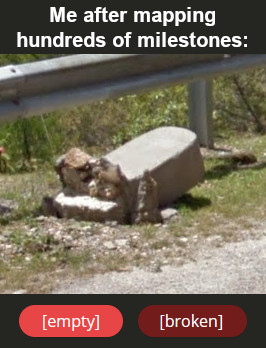

To be fair, I might have missed a stone or two. I have [a good excuse](https://maps.app.goo.gl/sCEF1s24xpC5qnDE6).

In this document, you will find:
* [An index of road numbers](#index) found at the top of milestones, with links to the relevant road section.
* [A systematic list of roads](#roads) where useful milestones can be found, along with an explainer about where specific road numbers can be found on them, if at all.

This document does not attempt to be comprehensive, so I also recommend exploring the [JSON file](./map.json) in [map-making.app](https://map-making.app/) for more details.

## Reading Milestones

In case you don’t know how a milestone works - everyone has to start somewhere, - it is essentially a three-in-one version of a road sign, kilometer marker, and [cow scratcher](https://maps.app.goo.gl/d8TbmY1CTc4uot5Z9).

In the following example, you are 107km along the AH-48 with Bunagu 4km ahead:

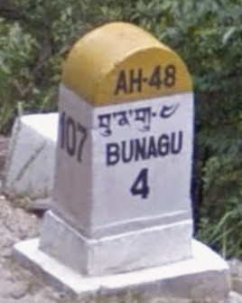

There does not seem to be an obvious rule as to where kilometer zero is chosen for any given road.

The reverse side of the stone contains more information about the next village(s) in the other direction.

The text can be written in [Latin script only](https://maps.app.goo.gl/LEYyZ3E8TfKyfwcp9), [Tibetan script only](https://maps.app.goo.gl/tt7tdYgJh47WFWSp9), or [both](https://maps.app.goo.gl/2kSXc8vXfDNFpjeu6). In fact, milestones are perhaps the only application for which learning how to read Dzongkha proves useful, especially since Google Maps only displays place names in Latin script. See [Romanization of Dzongkha](#dzongkha-romanization) to learn more.

Crucially, not all milestones have a road number on them. In such cases, it is very likely for all nearby stones to be similarly devoid of road numbers and you are better off looking for something else.

While milestones are found at intervals of one kilometer, you can also find [intermediary stones](https://maps.app.goo.gl/G8ocoUatmHrDgbLk7) (hectometer markers), usually every 200 meters, but those are not found everywhere and they tend to be quite inconsistent. Alongside the usual kilometer count on the side, they normally have a single digit on them, e.g. 6 = 600m from the previous milestone. They can occasionally contain the [road number](https://maps.app.goo.gl/qR5wUciuATYVZV2L7), but consider this the exception rather than the rule. Hectometer markers seem to display some regional characteristics but I did not map them.

## Index of Road Numbers

If you found a milestone in-game and don’t know the road number displayed at the top, use the following links to jump to the relevant section.
Note that identical road numbers with different formatting or writing systems are treated separately.

⚠ This list only applies to bona fide milestones. Hectometer markers may display a road number that differs in formatting to that of nearby miletones, for example [SL-02](https://maps.app.goo.gl/qR5wUciuATYVZV2L7)  (note the leading zero) in [SL-2 territory](https://maps.app.goo.gl/qzDVxbssM64pY2U88) rather than SL_02 territory.

* [AH-48](#ah48)
* [DISTRICT ROAD](#district_road_latin)
* [རྫོང་ཁག་འགྲུལ་འཁོར་ལམ](#district_road_tibetan)
* [རྫོང་ཁག་འགྲུལ་འཁོར་ལམ ↵ DISTRICT ROAD](#district_road_biscriptal)
* [DR](#dr)
* [DR-4](#snh)
* [DR_42](#dr42_latin)
* [དྲི་ཨར-༤༢ ↵ DR-42](#dr42_biscriptal)
* [དྲི་ཨར ༤༦ ↵ DR46](#dr46)
* [དྲི་ཨར ༤༧ ↵ DR47](#dr47)
* [FR](#fr)
* [ཨེཕ་ཨར FR](#dr47)
* [NH-2](#nh2)
* [གཞུང་ལམ-༢ ↵ NH-2](#nh2)
* [NH-3](#nh4_latin)
* [NH-4](#nh4_latin)
* [གཞུང་ལམ-༤ ↵ NH-4](#nh4_biscriptal)
* [PNH](#pnh_latin)
* [གཞུང་ལམ ↵ PNH](#pnh_biscriptal)
* [གཞུང་ལམ ༢ ↵ PNH-2](#pnh2)
* [SL-1](#sl1)
* [SL-2](#sl2_latin)
* [གཞུང་ལམ ༢ ↵ SL-2](#sl2_biscriptal)
* [གཞུང་ལམ་༠༢ ↵ SL_02](#sl02)
* [SL-4](#sl4)
* [SNH](#snh)
* [SNH-](#snh_trailing_hyphen)
* [གཞུང་ལམ-༢ ↵ ZHUNGLAM-2](#zhunglam2)
* [གཞུང་ལམ-༥ ↵ ZHUNGLAM-5](#zhunglam5)

## Roads

### Chhudzom - Haa - Bondey

#### SL-1

The road connecting Chhudzom to Bondey via Haa, plus the road to Damthang, exclusively appears as "SL-1" on milestones.

⚠ There are two suspicious SL-1 milestones in Thimphu: [#1](https://maps.app.goo.gl/oeBAC5ad6ao3jFtj9), [#2](https://maps.app.goo.gl/X61PHC18N9DPHJ3C6).

⚠ There is [a misplaced milestone in Lingzhi](https://maps.app.goo.gl/DBj9MvUm5jDhJ3c68) that reads [SL-2](#sl2_latin) in SL-1 territory.

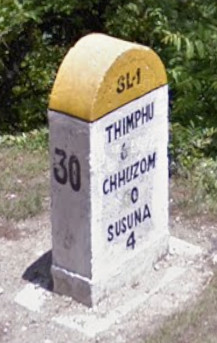

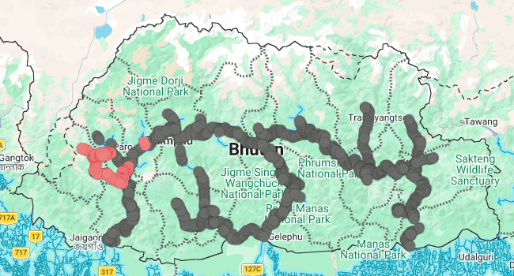

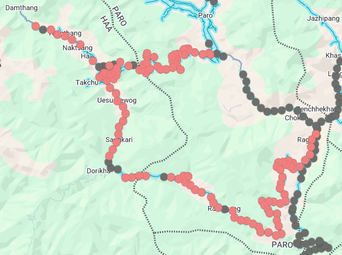

### Paro - Trashigang

This is by far the longest road in the country. As such, it has an impressive number of aliases. Fortunately, that means that finding a road number makes it easy to regionguess the road.

#### SL-2

The westernmost part of the road only features milestones with "SL-2" in Latin script. That includes:
* The road to Drugyel Dzong from Paro
* The Paro - Chhudzom section
* The Thimphu - Wangdue Phodrang section
* Some distance east of Wangdue Phodrang

⚠ There is [a misplaced milestone in Lingzhi](https://maps.app.goo.gl/DBj9MvUm5jDhJ3c68) that reads SL-2 in [SL-1](#sl1) territory.

⚠ The [AH-48](#ah48) used to be part of the SL-2, which is why there is a discontinuity between Chhudzom and Thimphu.

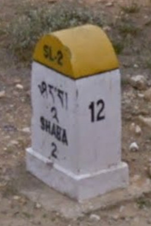

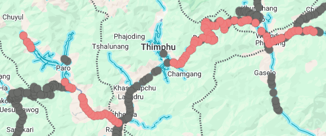

#### གཞུང་ལམ ༢ ↵ SL-2

Around Wangdue Phodrang, scattered alongside plain [SL-2](#sl2_latin) milestones, there are a few stones that read "[གཞུང་ལམ ༢](#dictionary) ↵ SL-2".

⚠ Not to be confused with [གཞུང་ལམ་༠༢ ↵ SL_02](#sl02) (note the difference in leading zero).

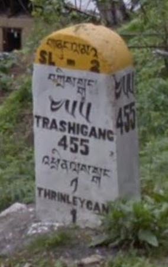

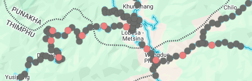

#### Uncoated milestones without any information

There is a sizable section of road in Wangdue Phodrang dzongkhag where one can find uncoated, usually very smooth-looking milestones. It is also quite common for them to be [broken at the base](https://maps.app.goo.gl/QWkYCtCRihH5Feqp7). Similar stones are very rare to find elsewhere, and they are [not usually as smooth](https://maps.app.goo.gl/1Uf444vjq9NEqp4a8).

⚠ Milestones [painted entirely in white](https://maps.app.goo.gl/xc7YpPwVa95C2v5E9) are considered separate.

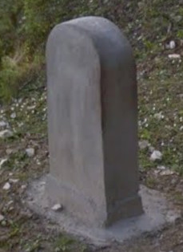

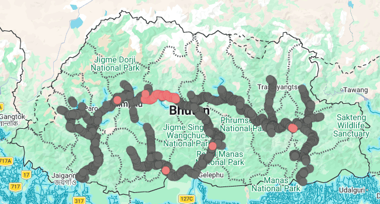

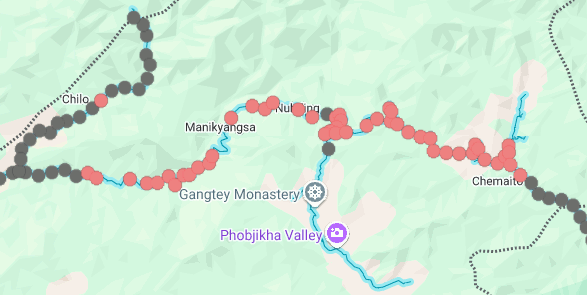

#### གཞུང་ལམ-༢ ↵ NH-2

There are two clusters of milestones where the road number appears as "[གཞུང་ལམ-༢](#dictionary) ↵ NH-2":
* One between Chuserby and Trongsa
* One in far western Mongar dzongkhag.

⚠ The only arguable exception to these two clusters is [a lone, barely legible stone](https://maps.app.goo.gl/vCBghstZ7CrKL9wJA) at the Trongsa/Bumthang dzongkhag border.

⚠ There are very few nonstandard-looking milestones without any Dzongkha in the road number. They can be found in the same general vicinity as the Mongar cluster, although more spread out: [#1](https://maps.app.goo.gl/AUucmU4EzoXQtUVg8), [#2](https://maps.app.goo.gl/n6a3isGZKd9uFpXC7), [#3](https://maps.app.goo.gl/CnrWAjsMapcoyHar8) (that should be all of them).

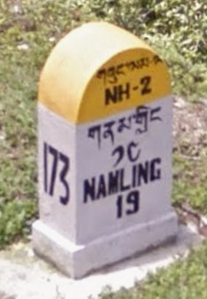

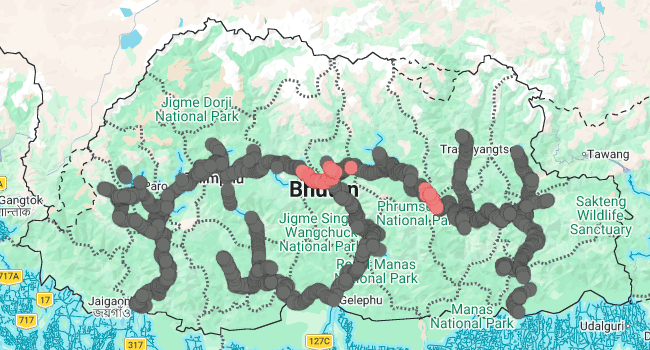

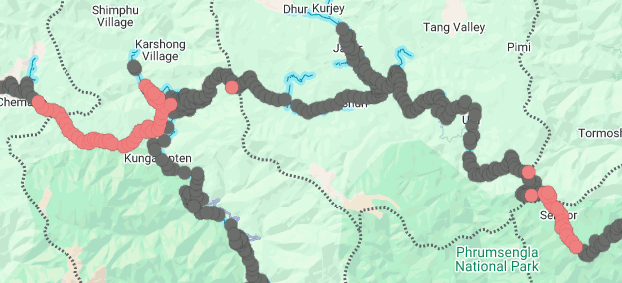

#### གཞུང་ལམ་༠༢ ↵ SL_02

Between Jakar and Ura, the road number is displayed as "[གཞུང་ལམ་༠༢](#dictionary) ↵ SL_02".

⚠ Not to be confused with [གཞུང་ལམ ༢ ↵ SL-2](#sl2_biscriptal) (note the difference in leading zero).

⚠ [Hectometer markers with "SL-02" written on them](https://maps.app.goo.gl/qR5wUciuATYVZV2L7) do not count.

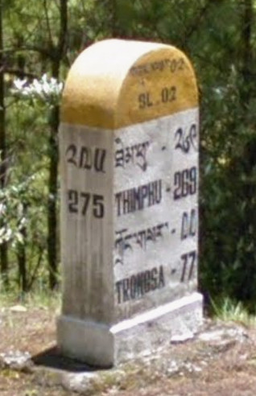

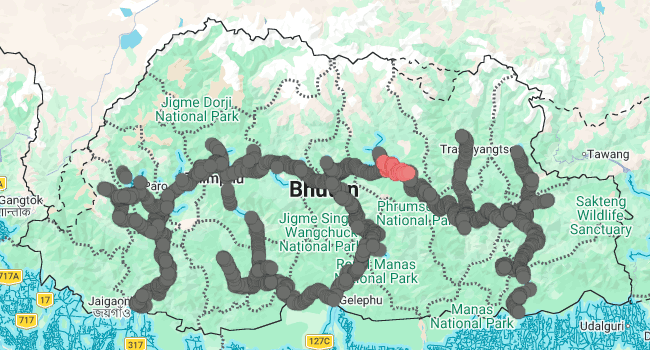

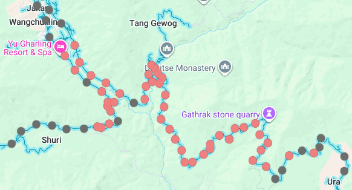

#### གཞུང་ལམ ༢ ↵ PNH-2

Near the Bumthang/Mongar/Lhuntse dzongkhag tripoint, there is a small clusters of "[གཞུང་ལམ ༢](#dictionary) ↵ PNH-2" milestones.

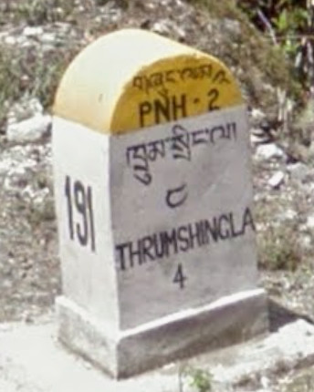

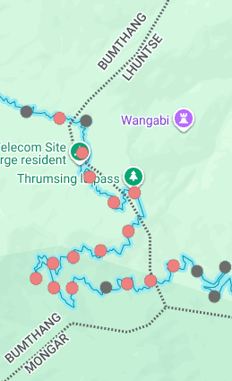

#### PNH

Most of Mongar dzongkhag uses "PNH" for the Paro - Trashigang road.

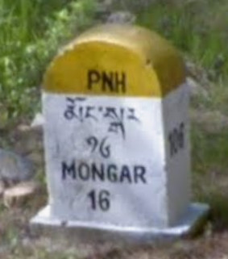

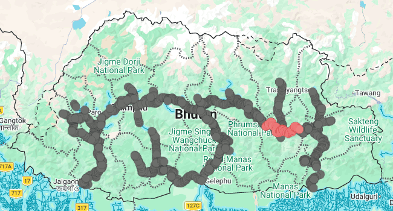

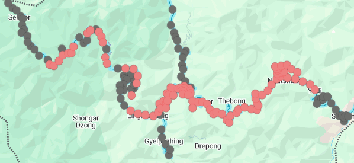

#### གཞུང་ལམ ↵ PNH

Scattered among the western part of the [PNH](#pnh_latin) cluster, one can find a few biscriptal stones: "[གཞུང་ལམ](#dictionary) ↵ PNH".

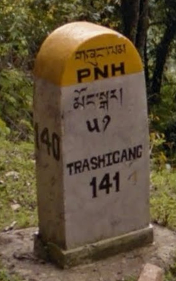

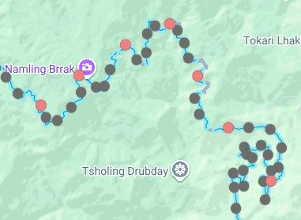

#### གཞུང་ལམ-༢ ↵ ZHUNGLAM-2

The road section from Yadi to Trashigang uses "[གཞུང་ལམ-༢](#dictionary) ↵ ZHUNGLAM-2".

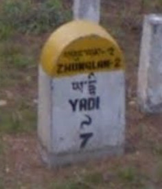

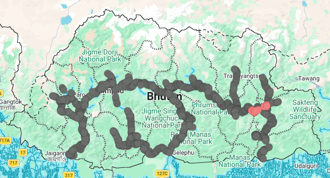

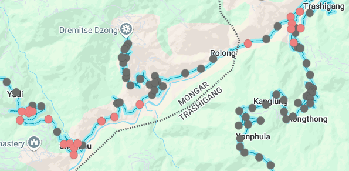

#### Coated milestones without any information

The remaining sections of the Paro - Trashigang road are mostly populated by typical milestones (rounded top, white body, yellow top) without any information whatsoever.

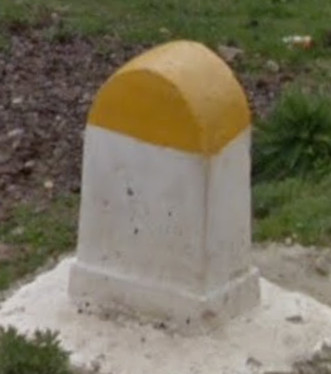

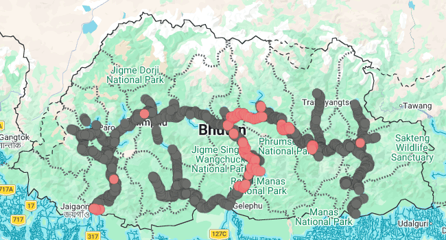

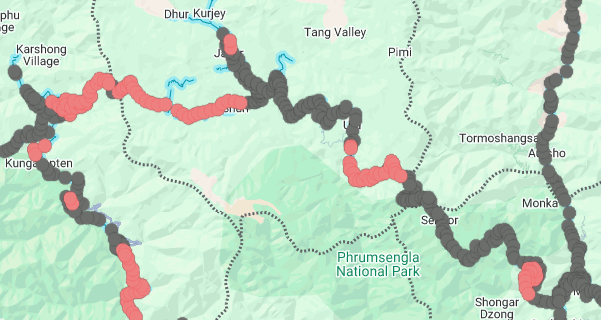

⚠ Identical milestones can be found, with scattered exceptions, along the [Gelephu - Trongsa road](#coated_no_info_nh4), as well as [east of Phuentsholing](https://maps.app.goo.gl/JRpo5QHUD94rU82k6):

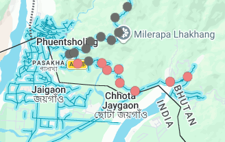

### Phuentsholing - Thimphu

#### AH-48

Although it used to be part of the [SL-2](#sl2_latin), the Phuentsholing - Thimpu road is now entirely marked as AH-48 (Asian Highway #48).

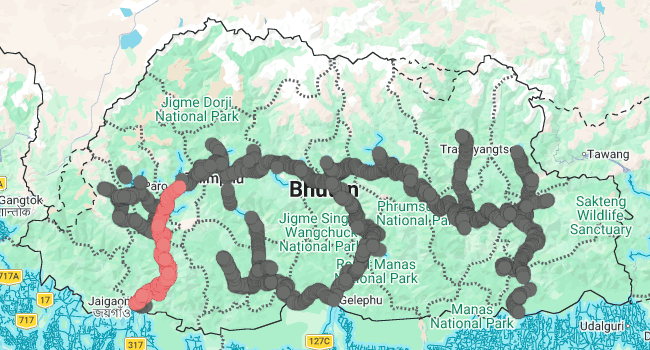

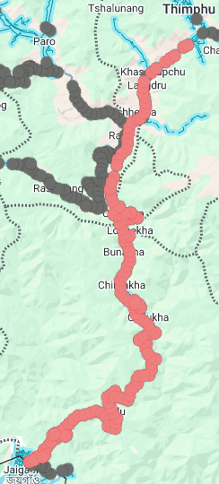

### Wangdue Phodrang - Tsirang

#### SL-4

Milestone coverage between Wangdue Phodrang and Tsirang tends to be spotty due to long sections being under [heavy roadwork](https://maps.app.goo.gl/DFumN15NBBufGKe78), but the sections where milestones can be found all read "SL-4".

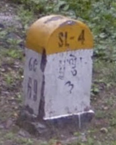

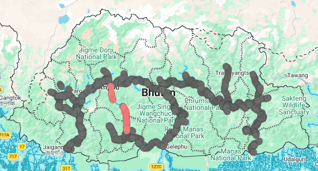

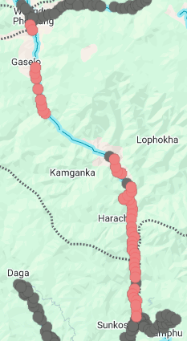

### Sopsokha - Punakha

#### DR

There are a few district roads (DRs) in the country, but interestingly, only the one west of Punakha is numbered as just "DR".

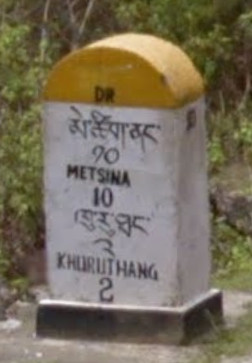

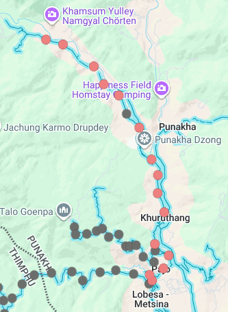

### Chuzomsa - Punakha

#### FR

Feeder Roads (FRs) tend not to have any milestones on them, but the road north of Chuzomsa leading to Punakha dzongkhag, in western Wangdue Phodrang dzongkhag, is one exception and is numbered as just "FR". Milestones are commonly flat-topped, but [not always](https://maps.app.goo.gl/FqGn2XL7wPyKWkW17).

⚠ The [Mongar - Lhuntse road](#dr47) has an offroad with [a single stone](https://maps.app.goo.gl/CsWfBiQxiupdesp78) that reads "[ཨེཕ་ཨར](#dictionary) FR".

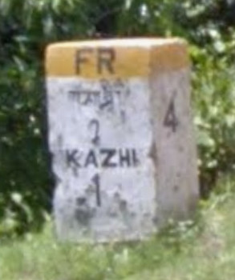

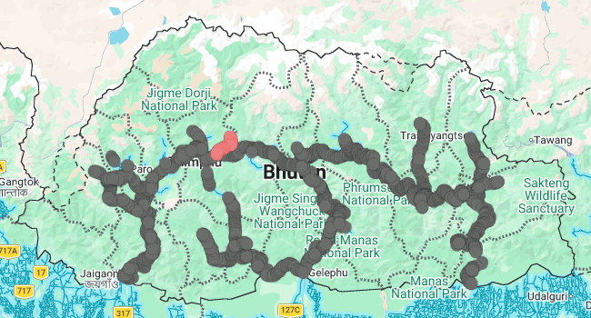

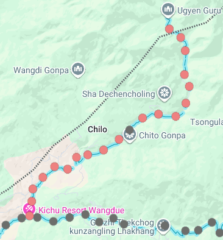

### Tsirang - Dagana

The Tsirang - Dagana road is another district road without a number. Milestones will read "DISTRICT ROAD" in Latin script, Tibetan script, or both, in alternation.

#### DISTRICT ROAD

"DISTRICT ROAD" is latin script can be found in the last ¾ths of the Tsirang - Dagana road.

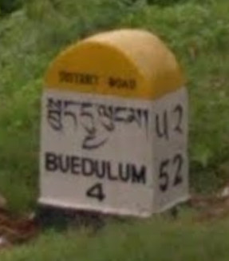

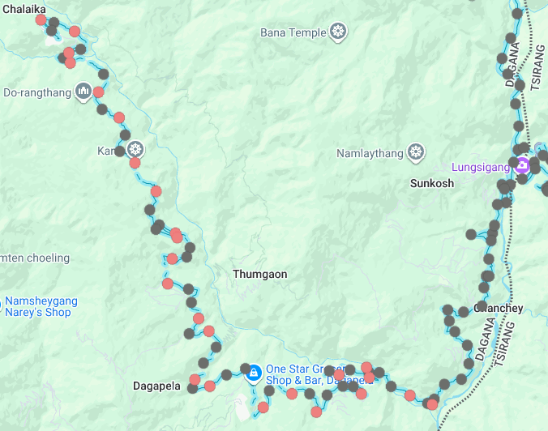

#### རྫོང་ཁག་འགྲུལ་འཁོར་ལམ

"[རྫོང་ཁག་འགྲུལ་འཁོར་ལམ](#dictionary)" (the equivalent of "DISTRICT ROAD" in Tibetan script) can be found in the last ¾ths of the Tsirang - Dagana road.

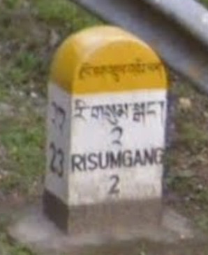

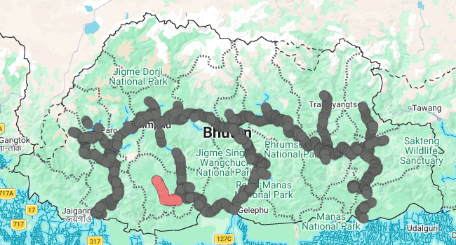

#### རྫོང་ཁག་འགྲུལ་འཁོར་ལམ ↵ DISTRICT ROAD

"[རྫོང་ཁག་འགྲུལ་འཁོར་ལམ](#dictionary) ↵ DISTRICT ROAD" is found all throughout the Tsirang - Dagana road, whereas monoscriptal versions of the same road number can only be found in the last ¾ths.

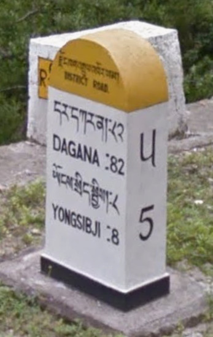

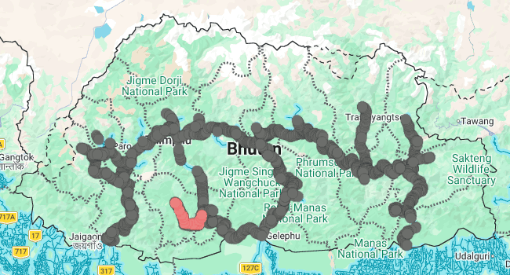

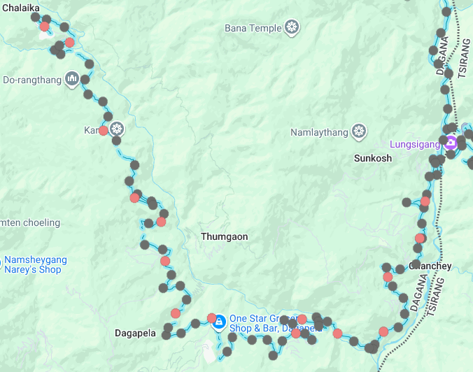

#### Coated milestones with information

The first fourth of the Tsirang - Dagana road is punctated by typical milestones (rounded top, white body, yellow top) with information but no road number on them.

⚠ [Similar hectometer markers](https://maps.app.goo.gl/iUYuiWXv6ud1RT2w5) can be found elsewhere, but they do not count. They look visibly smaller than usual milestones.

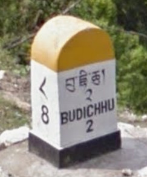

⚠ Comparable milestones can be found, with scattered exceptions, along the [Trashigang - Samdrup Jongkhar road](#coated_info_trashigang_samdrup_jongkhar), as well as northwest of Walakha:

Note that milestones along the Trashigang - Samdrup Jongkhar road should be consistently quite tall, while they are of varying height in other places.

### Gelephu - Tsirang

#### གཞུང་ལམ-༥ ↵ ZHUNGLAM-5

The Gelephu - Tsirang is consistently numbered as "[གཞུང་ལམ-༥](#dictionary) ↵ ZHUNGLAM-5".

### Gelephu - Trongsa

The Gelephu - Trongsa road is weird in that it only has one name, but is is not written everywhere, and the distribution of the two possible road number formats makes little sense. In addition, dirty milestones and poor visibility in the southern part of the road make it difficult to read the road number in the first place.

#### NH-4

"NH-4" in Latin script only is mostly found in two places:
* Some distance south of Trongsa
* Around Zhemgang

⚠ There is [a lone milestone south of Dandung that appears to read NH-3](https://maps.app.goo.gl/fvehNSd2pGCoWths8) instead of NH-4.

#### གཞུང་ལམ-༤ ↵ NH-4

"[གཞུང་ལམ-༤](#dictionary) ↵ NH-4" in Latin and Tibetan script is mostly found in two places:
* Around Dandung
* Some distance north of Gelephu

#### Coated milestones without any information

Much of the Gelephu - Trongsa roa, as well as the offroad southeast of Tingtibi, features typical milestones (rounded top, white body, yellow top) without any information whatsoever.

⚠ Identical milestones can be found, with scattered exceptions, along the [Paro - Trashigang road](#coated_no_info_nh2), as well as [east of Phuentsholing](https://maps.app.goo.gl/JRpo5QHUD94rU82k6):

### Mongar - Lhuntse

The Mongar - Lhuntse has two names. The transition occurs roughly at the dzongkhag border.

#### དྲི་ཨར ༤༦ ↵ DR46

In Mongar dzongkhag, the Mongar - Lhuntse road is known as "[དྲི་ཨར ༤༦](#dictionary) ↵ DR46".

#### དྲི་ཨར ༤༧ ↵ DR47

In Lhuntse dzongkhag, the Mongar - Lhuntse road is known as "[དྲི་ཨར ༤༧](#dictionary) ↵ DR47".

⚠ The DR47 has an offroad with [a single stone](https://maps.app.goo.gl/CsWfBiQxiupdesp78) that reads [ཨེཕ་ཨར](#dictionary) FR, not to be confused with the [Chuzomsa - Punakha FR road](#fr).

### Trashigang - Trashiyangtse

#### SNH

The majority of the Trashigang - Trashiyangtse road is numbered as "SNH", without a hyphen.

⚠ There is a stone in Duksum with [DR-4 on one side and SNH on the other](https://maps.app.goo.gl/Z6keYhQN11PRdmqh6). No other mention of the DR-4 can be found anywhere else, perhaps with [one exception](https://maps.app.goo.gl/9L6enKiAcfDbftWn9) whose full road number was not legible enough to determine with certainty.

#### SNH-

South of Doksum down to the Trashigang/Trashiyangtse dzongkhag border, milestones read "SNH-" with an infuriating trailing hyphen.

### Trashigang - Samdrup Jongkhar

#### Coated milestones with information

The Trashigang - Samdrup Jongkhar road exclusively features typical milestones (rounded top, white body, yellow top) with information but no road number on them.

⚠ [Similar hectometer markers](https://maps.app.goo.gl/iUYuiWXv6ud1RT2w5) can be found elsewhere, but they do not count. They look visibly smaller than usual milestones.

⚠ Comparable milestones can be found, with scattered exceptions, along the [Tsirang - Dagana road](#tsirang-dagana), as well as northwest of Walakha:

Note that milestones along the Trashigang - Samdrup Jongkhar road should be consistently quite tall, while they are of varying height in other places.

### Tshelingkhor - Gypsum

#### དྲི་ཨར-༤༢ ↵ DR-42

The initial part of the Tshelingkhor - Gypsum road is numbered as "[དྲི་ཨར-༤༢](#dictionary) ↵ DR-42".

#### DR_42

The final part of the Tshelingkhor - Gypsum road is numbered as "DR_42".

## Appendices

### Romanization of Dzongkha

The Latin script transcription of Dzongkha on Google Maps is more or less a diacritic-free version of [Roman Dzongkha](https://en.wikipedia.org/wiki/Roman_Dzongkha) (⚠ at the time of writing, Wikipedia shows the outdated 1991 version of the system).

The only up-to-date learning resource for Roman Dzongkha is section 3.6 "Roman Dzongkha and traditional orthography" of [The Grammar of Dzongkha (Karma Tshering & George van Driem, Himalayan Linguistics 2019)](https://escholarship.org/uc/item/1h4211k0). Appendix 3 "Place Names" is also particularly helpful. The book is not an easy read though, both because of its academic tone and because romanizing a language whose writing system has long diverged from its phonology is a complex task.

You can go a long way with the much easier to learn [Wylie transliteration system](https://en.wikipedia.org/wiki/Wylie_transliteration), but you have to keep in mind that you may encounter place names whose Wylie transliteration differs significantly from how they appear on the map. For example, Samdrup Jongkhar: བསམ་གྲུབ་ལྗོངས་མཁར, Wylie "bsam grub ljongs mkhar".

### Dzongkha-English Dictionary for Road Numbers

| Dzongkha | Wylie | Roman Dzongkha | Translation |
|----------|-------|----------------|-------------|
| གཞུང་ལམ | gzhung lam | zhunglam | highway |
| རྫོང་ཁག་འགྲུལ་འཁོར་ལམ | rdzong khag 'grul 'khor lam | dzongkhak drükhorlam | district road |
| དྲི་ཨར | dri ar | dri 'ar | DR (district road) |
| ཨེཕ་ཨར | eph ar | 'eph 'ar | FR (feeder road) |

For digits, see [Tibetan numerals](https://en.wikipedia.org/wiki/Tibetan_numerals).
