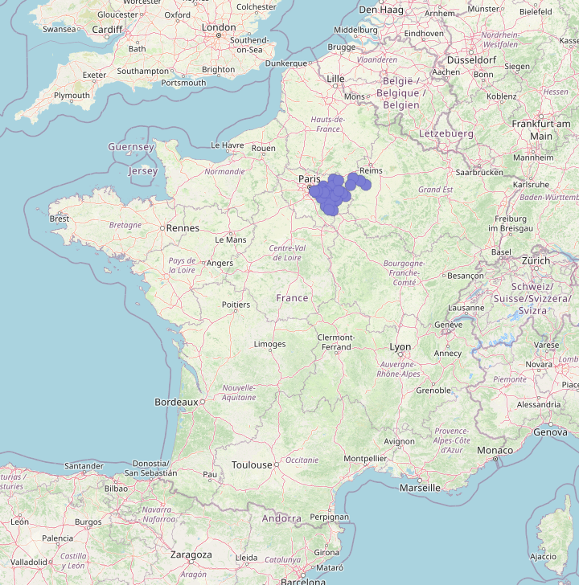
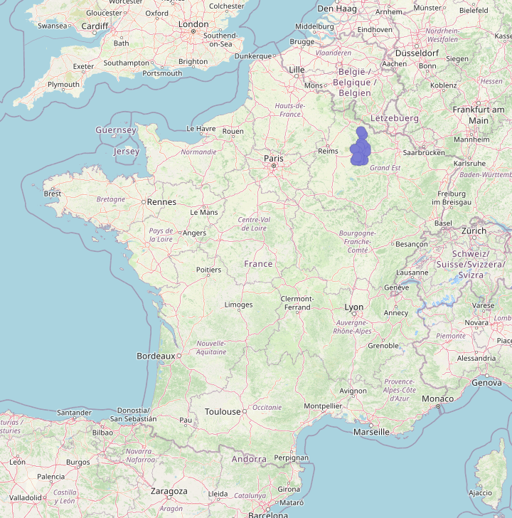
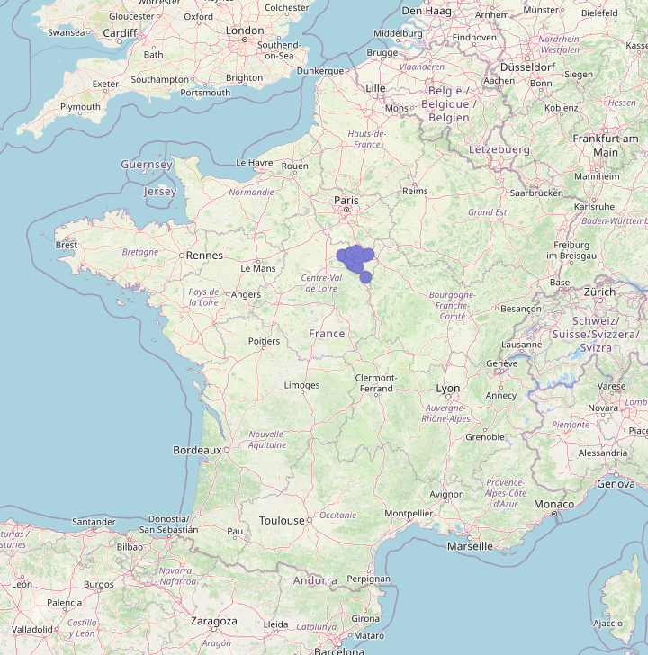

# The Most Useful Natural Regions of France

**By [MX-Futhark](https://www.geoguessr.com/user/5e6bccf53730754da880600a)**

**Training map [here](https://www.geoguessr.com/maps/67dd6ed2750621ec8618ebf1).**

_If you find a mistake in this document (typo, broken link, anything) or the map (broken location, unofficial coverage…), feel free to file an issue. Contributions will be mentioned above._

## Introduction

French toponyms are notorious among GeoGuessr players for being one of the most useful hints for regionguessing France: -court means northeast, -heim means Alsace. The river next to which the town is located is occasionally indicated in its name. But a perhaps lesser-known fact about French toponymy is that many towns will let you know more or less where they are in other ways, if you can exploit the information they give you. In some cases, it's not particularly useful: "[Chapelle-des-Bois](https://www.google.com/maps/place/25240+Chapelle-des-Bois)" means "Chapel in the woods". In other cases however, the end of the town name can contain the name of the region it is located in: "[Bourg-en-Bresse](https://www.google.com/maps/place/01000+Bourg-en-Bresse)" means "Town in [Bresse](https://en.wikipedia.org/wiki/Bresse)". It is then evident that knowing where Bresse is is a prerequisite to performing an informed guess.

Such suffixes most commonly refer to [natural regions](https://en.wikipedia.org/wiki/Natural_regions_of_France). These areas, called "pays" in French, are numerous and their borders not well defined, so it is not practical nor useful to learn them all by heart. Only a few of them are toponymically prolific, and this document aims at listing the most important regions to learn for the purpose for toponym-based regionguessing ⁽¹⁾. Note that historical or cultural regions, or even modern-day departments may occur as well.

The best way to tell if a town name contains the name of a larger place (whether a natural region or not) is to look for one of the following suffixes ⁽²⁾:
- `-en-<place>`
- `-en-l'<place>`
- `-d'<place>`
- `-de-<place>`
- `-de-l'<place>`
- `-du-<place>`
- `-de-la-<place>`
- `-des-<place>`
- `-à-<place>`
- `-au-<place>`
- `-à-la-<place>`
- `-aux-<place>`

Contrary to the `-sur-<river>` pattern highlighted in [this document](../rivers-of-france/README.md) which has its own regional bias, the above suffixes are used in commune names all over France, with the exception of Alsace, Corsica and much of Brittany, whose toponymy is historically not based on French language at all.

By far, `-en-<place>` is the pattern in which natural regions come up the most. Other patterns tend to be much more of a mixed bag (and in fact, many of them will not appear at all below) but are still included since quite a few regions exclusively show up through them. In many cases though, `<place>` does not refer to a specific region. The most common unhelpful words are shown below. There are many others, most of them uncommon or unique.

| French word | Translation | Example | Notes |
| ----------- | ----------- | ------- | ----- |
| Forêt | Forest | Bagnols‑en‑Forêt | |
| Bois<br>Bosc | Woods | Joué‑du‑Bois<br>La Neuville‑du‑Bosc | |
| Champ (pl: champs) | Field | Saint‑Pierre‑du‑Champ | |
| Pré (pl: prés) | Meadow | Vic‑des‑Prés | |
| Landes | Moorland or heathland | Rion‑des‑Landes | ⚠ There is a department called [Landes](https://en.wikipedia.org/wiki/Landes_(department)) but only one `-des-Landes` town is located there. |
| Vignes | Vineyard | Saint‑Jean‑des‑Vignes | |
| Désert | Desert | La Bazouge‑du‑Désert | The word used to have the more general sense of "infertile land". |
| Montagne | Mountain | Courcelles‑en‑Montagne | |
| Mont (pl: monts) | Peak | Saint‑Pierre‑du‑Mont | Not necessarily a high peak; can refer to a hill or cliff.<br><br>⚠ This word should still be taken into account if the name of the town refers to a specific hill. For example, [Orbigny-au-Mont](https://www.google.com/maps/place/52360+Orbigny-au-Mont) is not specific about the hill at the bottom of which it is located, but [La Chapelle-du-Mont-du-Chat](https://www.google.com/maps/place/La+Chapelle-du-Mont-du-Chat) is explicitly located on a flank of the [Mont du Chat](https://fr.wikipedia.org/wiki/Mont_du_Chat). |
| Val (pl: vaux)<br>Vallée<br>Vallon | Valley | Lailly‑en‑Val<br>Nanteuil‑en‑Vallée<br>Semur‑en‑Vallon | |
| Lac (pl: lacs) | Lake | Le Sauze‑du‑Lac | |
| Mer | Sea | Saintes‑Maries‑de‑la‑Mer | |
| Rivière | River | Saint‑Maurice‑en‑Rivière | |
| Île<br>Isle | Island | Noirmoutier‑en‑l'Île<br>Montier‑en‑l'Isle | ⚠ L'Isle is the name of [a river](https://en.wikipedia.org/wiki/Isle_(river)) that barely failed to reach the threshold in [Most Useful Rivers of France](../rivers-of-france/README.md). Therefore, `-sur-l'Isle` refers to towns located alongside this river and is a useful suffix for locating a place. |
| Tour | Tower | Le Plan‑de‑la‑Tour | |

Note that many region names share their etymology with a local town. This is especially true when the region ends with `ois` or `ais`. Some of these regions have made the list ([Ligny-en-Barrois](https://www.google.com/maps/place/55500+Ligny-en-Barrois,+France) ⇒ [Barrois](https://en.wikipedia.org/wiki/Barrois) ⇒ [Bar-le-Duc](https://www.google.com/maps/place/55000+Bar-le-Duc,+France)) but for those that didn’t, you may be able to locate them based on your pre-existing geographical knowledge ([Brancourt-en-Laonnois](https://www.google.com/maps/place/02320+Brancourt-en-Laonnois,+France) ⇒ [Laonnois](https://fr.wikipedia.org/wiki/Laonnois) ⇒ [Laon](https://www.google.com/maps/place/02000+Laon,+France)). However, some places lie outside the region their name suggests: [Saint-Romain-en-Viennois](https://www.google.com/maps/place/84110+Saint-Romain-en-Viennois) would have you believe it is located somewhere around [Vienne](https://www.google.com/maps/place/38200+Vienne), but actually lies much further south than the commonly accepted boundaries of the historical [Viennois region](https://fr.wikipedia.org/wiki/Viennois). Some of these points of reference are also particularly obscure ([Avesnes-en-Saosnois](https://www.google.com/maps/place/72260+Avesnes-en-Saosnois) ⇒ [Saosnes](https://www.google.com/maps/place/72600+Saosnes), 200 inhabitants) or have disappeared entirely ([Tardennois](https://en.wikipedia.org/wiki/Tardenois), whose etymology is the source of conflicting claims, may or may not have been named after a local town whose modern name is now unrelated), so don’t rely on this strategy too much.

And before we get to the meat of the subject, beware that it is common for natural regions to share their name with unrelated communes ([Anjou](https://www.google.com/maps/place/38150+Anjou), [Puisaye](https://www.google.com/maps/place/28250+La+Puisaye), [Corbières](https://www.google.com/maps/place/04220+Corbi%C3%A8res-en-Provence), etc.). Make sure to look for suffixes only.

⁽¹⁾ This is not the first time someone tried to do something similar: you may have seen [this map](https://images.squarespace-cdn.com/content/v1/60f6054f4e76b03092956de8/29a95a8c-5fb3-485b-9965-26a1a219b7d1/2_minortoponyms.png?) given as a side note in Plonkit's France guide. It hits many of the top entries in the present document, but is missing quite a few important regions.  
⁽²⁾ Occasionally, `<place>` may show up in a more complex suffix. The full list of patterns taken into account to constitute the list below is given in the following collapsible section:

<details>
<summary>Click me</summary>

The full pattern is quite complicated, especially if you are not familiar with French:
```
<preposition among en, de⁽¹⁾, à>
-<optional article ⁽¹⁾⁽²⁾>
-<optional prefixed qualifier ⁽³⁾>
-<place>
-<optional postfixed qualifier ⁽⁴⁾>

⁽¹⁾ If they precedes a vowel, de, le and la are shortened with an apostrophe and hyphenation is skipped.
    E.G. de-Anjou ⇒ d'Anjou.
⁽²⁾ Masculine and plural articles merge with de and à:
    - de + le ⇒ du
    - de + les ⇒ des
    - à + le ⇒ au
    - à + les ⇒ aux
⁽³⁾ Uncommon. In the list below, only Bretteville-du-Grand-Caux makes use of this element.
⁽⁴⁾ Uncommon. In the list below, only Segré-en-Anjou Bleu and Montcuq-en-Quercy-Blanc make use of this element.
```

The full combinatorics yield the following list of grammatically valid patterns, the majority of which are unused in commune names:
- `-en-<place>`
- `-en-<qualifier>-<place>`
- `-en-<place>-<qualifier>`
- `-en-l'<place>`
- `-en-l'<qualifier>-<place>`
- `-en-l'<place>-<qualifier>`
- `-en-le-<place>`
- `-en-le-<qualifier>-<place>`
- `-en-le-<place>-<qualifier>`
- `-en-la-<place>`
- `-en-la-<qualifier>-<place>`
- `-en-la-<place>-<qualifier>`
- `-en-les-<place>`
- `-en-les-<qualifier>-<place>`
- `-en-les-<place>-<qualifier>`
- `-d'<place>`
- `-d'<qualifier>-<place>`
- `-d'<place>-<qualifier>`
- `-de-<place>`
- `-de-<qualifier>-<place>`
- `-de-<place>-<qualifier>`
- `-de-l'<place>`
- `-de-l'<qualifier>-<place>`
- `-de-l'<place>-<qualifier>`
- `-du-<place>`
- `-du-<qualifier>-<place>`
- `-du-<place>-<qualifier>`
- `-de-la-<place>`
- `-de-la-<qualifier>-<place>`
- `-de-la-<place>-<qualifier>`
- `-des-<place>`
- `-des-<qualifier>-<place>`
- `-des-<place>-<qualifier>`
- `-à-<place>`
- `-à-<qualifier>-<place>`
- `-à-<place>-<qualifier>`
- `-à-l'<place>`
- `-à-l'<qualifier>-<place>`
- `-à-l'<place>-<qualifier>`
- `-au-<place>`
- `-au-<qualifier>-<place>`
- `-au-<place>-<qualifier>`
- `-à-la-<place>`
- `-à-la-<qualifier>-<place>`
- `-à-la-<place>-<qualifier>`
- `-aux-<place>`
- `-aux-<qualifier>-<place>`
- `-aux-<place>-<qualifier>`
</details>

## Methodology

The names of all [communes](https://en.wikipedia.org/wiki/Communes_of_France) (municipalities) in [metropolitan France](https://en.wikipedia.org/wiki/Metropolitan_France) matching the list of suffixes given above were taken into account, and filtered to only keep regions featured in eight names or more. The threshold of eight commune names was chosen because a few significant regions that most French people would know lie just outside the rounder threshold of ten commune names. Common words such as "woods" or "meadow" were explicitly excluded.

### Caveats

1. Not all toponyms named after natural regions match the given suffixes, which means that the numbers below are an underestimation of reality.
Getting accurate numbers would require diving deep into the etymology of some place names, which is difficult both for me and for casual players, who are likely to stick to recognizing the obvious patterns.
Note that just because a toponym includes the name of a region does not mean that it was named after it, even though it might be the case sometimes.
For example, [Bray-en-Val](https://www.google.com/maps/place/Bray-en-Val,+45460+Bray-Saint-Aignan) is completely unrelated to the [Pays de Bray](https://en.wikipedia.org/wiki/Pays_de_Bray), but [Bresse Vallons](https://www.google.com/maps/place/01340+Bresse+Vallons)'s name does derive from [Bresse](https://en.wikipedia.org/wiki/Bresse).
2. Much like there are dozens of "Springfield"s in the USA, region names in France are not necessarily unique. As you will see, there are multiple instances where a region name may refer to separate locations. In such cases, all homonyms are listed under the same entry if the sum of relevant communes reaches the threshold.
3. Official commune names do not necessarily match the name under which they are found on Streetview. Communes are regularly updated, therefore recently created one such as [Quissac-en-Quercy](https://www.google.com/maps/place/46320+Quissac) may not yet appear on Streetview. Conversely, recently removed ones such as [Saint-Sylvain-d'Anjou](https://www.google.com/maps/place/Saint-Sylvain-d'Anjou,+49480+Verri%C3%A8res-en-Anjou) can still show up (and may still exist as a town rather than a commune).
4. Some natural regions do not have a standard spelling (e.g. [Valgaudemar / Valgodemar](https://fr.wikipedia.org/wiki/Valgaudemar)). These cases are difficult to detect and as a result, separate spellings are counted as separate regions. Fortunately, such cases are extremely uncommon and as far as I can tell, none of them would have made the list with a unified spelling anyway.
5. A few regions reliably show up through plain suffixes only, without a preposition. Examples include [Minervois](https://fr.wikipedia.org/wiki/Minervois) (e.g. [Argens-Minervois](https://www.google.com/maps/place/11200+Argens-Minervois)), [Lauragais](https://en.wikipedia.org/wiki/Lauragais) (e.g. [La Louvière-Lauragais](https://www.google.com/maps/place/11410+La+Louvi%C3%A8re-Lauragais)) or [Savès](https://fr.wikipedia.org/wiki/Sav%C3%A8s) (e.g. [Castillon-Savès](https://www.google.com/maps/place/32490+Castillon-Sav%C3%A8s)). Unfortunately, such plain suffixes tend to be treacherous, for instance [Baguer-Morvan](https://www.google.com/maps/place/35120+Baguer-Morvan) is located nowhere near the [Morvan](https://en.wikipedia.org/wiki/Morvan). Generally speaking, it is also difficult to determine whether a plain suffix corresponds to a natural region or not. Therefore, as a matter of consistency and simplicity, these regions are not included in the list even if they would otherwise reach the threshold, although it does not mean that they are not worth knowing regardless.

## Structure

Regions are listed from most to least useful based on the amount of towns named after them. All entries use the following template:

**Info**: Usually a Wikipedia link about the region, in English. You may want to switch the language to French for more details for some of them.

**Location**: A raster image showing where the relevant towns are located on the map.

**Communes**: A collapsible list of communes named after the region, with the total amount between parentheses. The communes are categorized by departments, sorted by amount of relevant communes. You are not expected to memorize the communes (not that I am forbidding you from trying), but they are provided for the sake of completeness.

## The List

1. <a href="#spot-01">Brie</a>: 35 communes
1. <a href="#spot-02">Auge</a>: 29 communes (⚠️ includes 1 unrelated commune)
1. <a href="#spot-03">Vexin</a>: 23 communes
1. <a href="#spot-04">Bresse</a>: 21 communes
1. <a href="#spot-05">Argonne</a>: 21 communes
1. <a href="#spot-06">Bray</a>: 18 communes
1. <a href="#spot-07">Anjou</a>: 18 communes (⚠️ includes 1 unrelated commune)
1. <a href="#spot-08">Beauce</a>: 17 communes
1. <a href="#spot-09">Armagnac</a>: 17 communes
1. <a href="#spot-10">Quercy</a>: 17 communes
1. <a href="#spot-11">Bretagne</a>: 16 communes
1. <a href="#spot-12">Gâtinais</a>: 16 communes
1. <a href="#spot-13">Champagne</a>: 16 communes (⚠️ 2 separate regions)
1. <a href="#spot-14">Caux</a>: 14 communes
1. <a href="#spot-15">Morvan</a>: 15 communes
1. <a href="#spot-16">Allier</a>: 13 communes
1. <a href="#spot-17">Perche</a>: 13 communes
1. <a href="#spot-18">Touraine</a>: 13 communes
1. <a href="#spot-19">Woëvre</a>: 13 communes
1. <a href="#spot-20">Périgord</a>: 13 communes
1. <a href="#spot-21">Diois</a>: 12 communes
1. <a href="#spot-22">Sologne</a>: 11 communes
1. <a href="#spot-23">Santerre</a>: 11 communes
1. <a href="#spot-24">Bessin</a>: 11 communes
1. <a href="#spot-25">Aude</a>: 11 communes
1. <a href="#spot-26">Vercors</a>: 10 communes
1. <a href="#spot-27">Royans</a>: 10 communes
1. <a href="#spot-28">Othe</a>: 10 communes
1. <a href="#spot-29">Barrois</a>: 10 communes (⚠️ 2 separate regions)
1. <a href="#spot-30">Cambrésis</a>: 10 communes
1. <a href="#spot-31">Artois</a>: 10 communes
1. <a href="#spot-32">Provence</a>: 10 communes
1. <a href="#spot-33">Forez</a>: 9 communes
1. <a href="#spot-34">Mont d'Or</a>: 9 communes
1. <a href="#spot-35">Puisaye</a>: 9 communes
1. <a href="#spot-36">Haye</a>: 9 communes (⚠️ includes 3 unrelated communes)
1. <a href="#spot-37">Valois</a>: 9 communes
1. <a href="#spot-38">France</a>: 9 communes (⚠️ misleading name, includes 1 unrelated commune)
1. <a href="#spot-39">Yvelines</a>: 9 communes
1. <a href="#spot-40">Corbières</a>: 9 communes
1. <a href="#spot-41">Comminges</a>: 9 communes
1. <a href="#spot-42">Maine</a>: 9 communes
1. <a href="#spot-43">Retz</a>: 8 communes (⚠️ 2 separate regions, includes 1 unrelated commune)
1. <a href="#spot-44">Béarn</a>: 8 communes
1. <a href="#spot-45">Razès</a>: 8 communes

----------

### <span id="spot-01">1. Brie 🥇</span>

While you have most likely heard of [the cheese](https://en.wikipedia.org/wiki/Brie) before, the region it comes from is not as widely known. Brie extends from the southeast of Paris all the way into the plains of [Champagne](https://en.wikipedia.org/wiki/Champagne_(province)).

**Info**: [Wikipedia](https://en.wikipedia.org/wiki/Brie_(region))

**Location**:  


**Communes** (35):

<details>
<summary>Click me</summary>

- Seine-et-Marne
  * Armentières-en-Brie
  * Augers-en-Brie
  * Chailly-en-Brie
  * Chanteloup-en-Brie
  * Le Châtelet-en-Brie
  * Chaumes-en-Brie
  * Choisy-en-Brie
  * Crèvecœur-en-Brie
  * La Croix-en-Brie
  * Ferrières-en-Brie
  * La Houssaye-en-Brie
  * Laval-en-Brie
  * Leudon-en-Brie
  * Liverdy-en-Brie
  * Maisoncelles-en-Brie
  * Marles-en-Brie
  * Marolles-en-Brie ⁽¹⁾
  * Neufmoutiers-en-Brie
  * Presles-en-Brie
  * Reuil-en-Brie
  * Roissy-en-Brie
  * Rozay-en-Brie
  * Saint-Just-en-Brie
  * Saint-Ouen-en-Brie
  * Soignolles-en-Brie
  * Tournan-en-Brie
  * Valence-en-Brie
  * Vaudoy-en-Brie
- Val-de-Marne
  * Marolles-en-Brie ⁽¹⁾
  * La Queue-en-Brie
  * Sucy-en-Brie
- Marne
  * Loisy-en-Brie
  * Mareuil-en-Brie
- Aisne
  * Condé-en-Brie
  * Dhuys et Morin-en-Brie

⁽¹⁾ There are indeed two separate communes with the same name in two adjacent departments.
</details>

----------

### <span id="spot-02">2. Auge 🥈</span>

The Pays d'Auge is a natural region of Normandy, mostly confined to the eastern third of modern-day Calvados. The town of [Camembert](https://www.google.com/maps/place/61120+Camembert) is located there.

⚠ [Val-d’Auge](https://www.google.com/maps/place/16170+Val-d'Auge) is a commune in Charente that comes from the renaming of a former commune called Auge, unrelated to the natural region.

**Info**: [Wikipedia](https://en.wikipedia.org/wiki/Pays_d%27Auge)

**Location**:  


**Communes** (29):

<details>
<summary>Click me</summary>

Auge proper (28):
- Calvados
  * Barou-en-Auge
  * Beaumont-en-Auge
  * Belle Vie en Auge
  * Beuvron-en-Auge
  * Le Breuil-en-Auge
  * Castillon-en-Auge
  * Cricqueville-en-Auge
  * Douville-en-Auge
  * Englesqueville-en-Auge
  * Gonneville-en-Auge
  * Hotot-en-Auge
  * Livarot-Pays-d'Auge ⁽¹⁾
  * Méry-Bissières-en-Auge
  * Mézidon Vallée d'Auge ⁽¹⁾
  * Montreuil-en-Auge
  * Les Moutiers-en-Auge
  * Norrey-en-Auge
  * Périers-en-Auge
  * Pierrefitte-en-Auge
  * Le Pré-d'Auge
  * Putot-en-Auge
  * Saint-Pierre-en-Auge
  * Saint-Vaast-en-Auge
  * Le Theil-en-Auge
  * Tourville-en-Auge
- Orne
  * Gouffern en Auge
  * Louvières-en-Auge
  * Sap-en-Auge

Unrelated (1):
- Charente
  * Val-d'Auge

⁽¹⁾ While they look like regular d'Auge suffixes at first sight, these commune names parse respectively as Livarot / Pays d'Auge and Mézidon / Auge Valley, so while their presence on the list based on the sole criterion of matching suffix is justified, they do not indicate where they are located on a grammatical level per se. They are still, however, located in Auge.
</details>

----------

### <span id="spot-03">3. Vexin 🥉</span>

Vexin is a natural region in northwestern France roughly located between Rouen and Paris. It has [a national park to its name](https://www.google.com/maps/@49.0955178,1.8814601,11.43z), which makes it easy to locate on the map.

**Info**: [Wikipedia](https://en.wikipedia.org/wiki/Vexin)

**Location**:  


**Communes** (23):

<details>
<summary>Click me</summary>

- Val-d'Oise
  * Le Bellay-en-Vexin
  * La Chapelle-en-Vexin
  * Cléry-en-Vexin
  * Cormeilles-en-Vexin
  * Guiry-en-Vexin
  * Hérouville-en-Vexin
  * Magny-en-Vexin
  * Maudétour-en-Vexin
  * Neuilly-en-Vexin
- Eure
  * Doudeauville-en-Vexin
  * Frenelles-en-Vexin
  * Gamaches-en-Vexin
  * Houville-en-Vexin
  * Mézières-en-Vexin
  * Nojeon-en-Vexin
  * Les Thilliers-en-Vexin
  * Villers-en-Vexin
- Oise
  * Boury-en-Vexin
  * Chaumont-en-Vexin
  * La Corne-en-Vexin
  * Montagny-en-Vexin
- Yvelines
  * Brueil-en-Vexin
  * Lainville-en-Vexin
</details>

----------

### <span id="spot-04">4. Bresse</span>

Another famous [cheese-producing](https://en.wikipedia.org/wiki/Bleu_de_Bresse) region: Bresse is both a natural region and a former province located not too far away from Switzerland, and is featured in many place names of modern-day Saône-et-Loire in particular, midway between [Dijon](https://www.google.com/maps/place/21000+Dijon) and [Lyon](https://www.google.com/maps/place/Lyon).

**Info**: [Wikipedia](https://en.wikipedia.org/wiki/Bresse)

**Location**:  


**Communes** (21):

<details>
<summary>Click me</summary>

- Saône-et-Loire
  * Beaurepaire-en-Bresse
  * Châtenoy-en-Bresse
  * Dampierre-en-Bresse
  * Flacey-en-Bresse
  * Frangy-en-Bresse
  * Lessard-en-Bresse
  * Montpont-en-Bresse
  * Mouthier-en-Bresse
  * Pierre-de-Bresse
  * Saint-André-en-Bresse
  * Saint-Bonnet-en-Bresse
  * Saint-Christophe-en-Bresse
  * Saint-Didier-en-Bresse
  * Saint-Étienne-en-Bresse
  * Saint-Martin-en-Bresse
  * Saint-Vincent-en-Bresse
  * Sainte-Croix-en-Bresse
  * Serrigny-en-Bresse
- Ain
  * Bourg-en-Bresse
  * Montrevel-en-Bresse
- Jura
  * La Chaux-en-Bresse
</details>

----------

### <span id="spot-05">5. Argonne</span>

Argonne is a hilly strip of woodland located at the junction between the modern-day departments of Ardennes, Marne and Meuse. [Louis XVI was caught there](https://en.wikipedia.org/wiki/Flight_to_Varennes) when he attempted to flee during the French Revolution.

**Info**: [Wikipedia](https://en.wikipedia.org/wiki/Forest_of_Argonne)

**Location**:  


**Communes** (21):

<details>
<summary>Click me</summary>

- Meuse
  * Beaufort-en-Argonne
  * Beaulieu-en-Argonne
  * Brabant-en-Argonne
  * Brocourt-en-Argonne
  * Clermont-en-Argonne
  * Dombasle-en-Argonne
  * Esnes-en-Argonne
  * Gesnes-en-Argonne
  * Jouy-en-Argonne
  * Montfaucon-d'Argonne
  * Neuvilly-en-Argonne
  * Pretz-en-Argonne
  * Seuil-d'Argonne
  * Varennes-en-Argonne
- Marne
  * Belval-en-Argonne
  * Florent-en-Argonne
  * Givry-en-Argonne
  * Passavant-en-Argonne
  * Saint-Thomas-en-Argonne
  * Villers-en-Argonne
- Ardennes
  * Beaumont-en-Argonne
</details>

----------

### <span id="spot-06">6. Bray</span>

The Pays de Bray is a thin strip of [bocage](https://en.wikipedia.org/wiki/Bocage) located north of Vexin, and has a surprising amount of communes named after it.

**Info**: [Wikipedia](https://en.wikipedia.org/wiki/Pays_de_Bray)

**Location**:  


**Communes** (18):

<details>
<summary>Click me</summary>

- Seine-Maritime
  * Avesnes-en-Bray
  * Bures-en-Bray
  * Dampierre-en-Bray
  * Elbeuf-en-Bray
  * Ferrières-en-Bray
  * Fontaine-en-Bray
  * Gournay-en-Bray
  * Mesnières-en-Bray
  * Neufchâtel-en-Bray
  * Roncherolles-en-Bray
  * Sigy-en-Bray
- Oise
  * Berneuil-en-Bray
  * Cuigy-en-Bray
  * Hodenc-en-Bray
  * Ons-en-Bray
  * Puiseux-en-Bray
  * Saint-Aubin-en-Bray
  * Saint-Léger-en-Bray
</details>

----------

### <span id="spot-07">7. Anjou</span>

Here comes the first entry that is not strictly speaking a natural region: Anjou is a former duchy centered around [Angers](https://www.google.com/maps/place/Angers) (with which it shares its etymology). It roughly corresponds to modern-day Maine-et-Loire.

⚠ Anjou throws one curveball at you: [Labastide-d'Anjou](https://www.google.com/maps/place/11320+Labastide-d'Anjou) (lit. "The [bastide](https://en.wikipedia.org/wiki/Bastide) of Anjou") was founded by the duke of Anjou but is located nowhere near the borders of the former duchy.

**Info**: [Wikipedia](https://en.wikipedia.org/wiki/Duchy_of_Anjou#Province_of_Anjou)

**Location**:  


**Communes** (18):

<details>
<summary>Click me</summary>

Anjou proper (17):
- Maine-et-Loire
  * Baugé-en-Anjou
  * Beaufort-en-Anjou
  * Les Bois d'Anjou
  * Chemillé-en-Anjou
  * Doué-en-Anjou
  * Erdre-en-Anjou
  * Les Hauts-d'Anjou
  * Longuenée-en-Anjou
  * Ombrée d'Anjou
  * Orée d'Anjou
  * Saint-Barthélemy-d'Anjou
  * Sceaux-d'Anjou
  * Segré-en-Anjou Bleu
  * Thorigné-d'Anjou
  * Verrières-en-Anjou
- Mayenne
  * Prée-d'Anjou
  * Saint-Denis-d'Anjou

Founded by the duke of Anjou (1):
- Aude
  * Labastide-d'Anjou
</details>

----------

### <span id="spot-08">8. Beauce</span>

Beauce is a largely flat agricultural region which straddles modern-day Eure-et-Loire and Loiret.

**Info**: [Wikipedia](https://en.wikipedia.org/wiki/Beauce,_France)

**Location**:  


**Communes** (17):

<details>
<summary>Click me</summary>

- Eure-et-Loire
  * Éole-en-Beauce
  * Garancières-en-Beauce
  * Janville-en-Beauce
  * Neuvy-en-Beauce
  * Orgères-en-Beauce
  * Vitray-en-Beauce
- Loiret
  * Charmont-en-Beauce
  * Épieds-en-Beauce
  * Greneville-en-Beauce
  * Lion-en-Beauce
  * Morville-en-Beauce
  * Rozières-en-Beauce
- Loir-et-Cher
  * Champigny-en-Beauce
  * Huisseau-en-Beauce
  * Marcilly-en-Beauce
  * Saint-Léonard-en-Beauce
- Essonne
  * Marolles-en-Beauce
</details>

----------

### <span id="spot-09">9. Armagnac</span>

Armagnac is a former county within the [duchy of Gascony](https://en.wikipedia.org/wiki/Gascony) located just over a third of the way from the Atlantic Ocean to [Toulouse](https://www.google.com/maps/place/Toulouse). Nowadays, it is better known for [its booze](https://fr.wikipedia.org/wiki/Armagnac_(eau-de-vie)).

**Info**: [Wikipedia](https://en.wikipedia.org/wiki/County_of_Armagnac)

**Location**:  


**Communes** (17):

<details>
<summary>Click me</summary>

- Gers
  * Bretagne-d'Armagnac
  * Campagne-d'Armagnac
  * Castex-d'Armagnac
  * Caupenne-d'Armagnac
  * Lias-d'Armagnac
  * Mauléon-d'Armagnac
  * Monlezun-d'Armagnac
  * Saint-Martin-d'Armagnac
  * Sainte-Christie-d'Armagnac
  * Salles-d'Armagnac
  * Termes-d'Armagnac
- Landes
  * Arthez-d'Armagnac
  * Betbezer-d'Armagnac
  * Créon-d'Armagnac
  * Labastide-d'Armagnac
  * Mauvezin-d'Armagnac
  * Saint-Julien-d'Armagnac
</details>

----------

### <span id="spot-10">10. Quercy</span>

Quercy is both a natural region and a former province, spanning the entirety of modern-day Lot and the northern parts of Tarn-et-Garonne.

ℹ All `-de-Quercy` communes are located in Tarn-et-Garonne, usually with French-Occitan bilingual town entry signs where `-de-Quercy` normally corresponds with `de Carcin`; although the Occitan town name sometimes completely deviates from the French one.

⚠ Many `-en-Quercy` communes in Lot were recently created and signage that mentions Quercy is still sparse as of early 2025.

⚠ Quercy is commonly abbreviated as Q<sup>CY</sup> in signage.

**Info**: [Wikipedia](https://en.wikipedia.org/wiki/Quercy)

**Location**:  


**Communes** (17):

<details>
<summary>Click me</summary>

- Lot
  * Barguelonne-en-Quercy
  * Belfort-du-Quercy
  * Lendou-en-Quercy
  * Limogne-en-Quercy
  * Montcuq-en-Quercy-Blanc
  * Porte-du-Quercy
  * Quissac-en-Quercy ⁽¹⁾
  * Saint-Maurice-en-Quercy
  * Sousceyrac-en-Quercy
  * Le Vigan-en-Quercy ⁽²⁾
  * Le Vignon-en-Quercy
- Tarn-et-Garonne
  * Bouloc-en-Quercy
  * Miramont-de-Quercy
  * Monclar-de-Quercy
  * Montaigu-de-Quercy
  * Montpezat-de-Quercy
  * Puygaillard-de-Quercy

⁽¹⁾ Not in the training map (Quissac before 2024)  
⁽²⁾ Not in the training map (Le Vigan before 2025)
</details>

----------

### <span id="spot-11">11. Bretagne</span>

Bretagne is the French name of [Brittany](https://en.wikipedia.org/wiki/Brittany_(administrative_region)). You probably already know that much. However, `-de-Bretagne` towns should be understood as being part of the former duchy of Brittany, which used to extend to modern day Loire-Atlantique. Not only that, but only the historically French-speaking part of the duchy uses this suffix; you won’t find any of them within the Breton language area.

⚠ Bretagne is commonly abbreviated as B<sup>GNE</sup> in signage.

**Info**: [Wikipedia](https://en.wikipedia.org/wiki/Duchy_of_Brittany)

**Location**:  


**Communes** (16):

<details>
<summary>Click me</summary>

- Ille-et-Vilaine
  * Bain-de-Bretagne
  * La Bosse-de-Bretagne
  * Chartres-de-Bretagne
  * Dol-de-Bretagne
  * La Guerche-de-Bretagne
  * Montauban-de-Bretagne
  * Parthenay-de-Bretagne
  * Le Sel-de-Bretagne
  * Sens-de-Bretagne
  * Le Theil-de-Bretagne
- Loire-Atlantique
  * Fay-de-Bretagne
  * La Meilleraye-de-Bretagne
  * Montoir-de-Bretagne
  * Sainte-Reine-de-Bretagne
  * Le Temple-de-Bretagne
  * Vigneux-de-Bretagne
</details>

----------

### <span id="spot-12">12. Gâtinais</span>

Gâtinais is a former county and natural region located a fair way south of Paris, east of [Orléans](https://www.google.com/maps/place/Orl%C3%A9ans). While the county used to extend much further north, all relevant `-en-Gâtinais` communes are essentially confined to the northeastern quarter of Loiret.

⚠ Gâtinais is also occasionally called Gâtine, which is an old word that used to refer to infertile land. There are multiple natural regions called Gâtine or a variation thereof in France. Therefore you might find `-en-Gâtine(s)` communes in other places, especially in Deux-Sèvres.

**Info**: [Wikipedia](https://en.wikipedia.org/wiki/G%C3%A2tinais)

**Location**:  



**Communes** (16):

<details>
<summary>Click me</summary>

- Loiret
  * Auvilliers-en-Gâtinais
  * Barville-en-Gâtinais
  * Batilly-en-Gâtinais
  * Bordeaux-en-Gâtinais
  * Bouilly-en-Gâtinais
  * Chailly-en-Gâtinais
  * Feins-en-Gâtinais
  * Ferrières-en-Gâtinais
  * Fréville-du-Gâtinais
  * Mézières-en-Gâtinais
  * Oussoy-en-Gâtinais
  * Pers-en-Gâtinais
  * Sceaux-du-Gâtinais
  * Treilles-en-Gâtinais
- Seine-et-Marne
  * Beaumont-du-Gâtinais
  * Maisoncelles-en-Gâtinais
</details>

----------

### <span id="spot-13">13. Champagne</span>

Champagne is an old generic term that mostly refers to (often chalk lined) flat landscapes. There are multiple natural regions called Champagne, [some of which](https://fr.wikipedia.org/wiki/Champagne_berrichonne_(r%C3%A9gion_naturelle)) being toponymically sterile. The one that gave its name to the highest number of town names is located [within the former province of Maine](https://fr.wikipedia.org/wiki/G%C3%A9ographie_du_Maine#Champagne), and is separate from [the one](https://en.wikipedia.org/wiki/Champagne_crayeuse) that gave its name to [the famous sparkling wine](https://en.wikipedia.org/wiki/Champagne) and [former province](https://en.wikipedia.org/wiki/Champagne_(province)). Note that the latter has some overlap with the easternmost part of Brie.

**Info**: [Champagne mainiote](https://fr.wikipedia.org/wiki/G%C3%A9ographie_du_Maine#Champagne), [Champagne crayeuse](https://en.wikipedia.org/wiki/Champagne_crayeuse)

**Location**:  


**Communes** (16):

<details>
<summary>Click me</summary>

Champagne mainiote (9):
- Sarthe
  * Bernay-Neuvy-en-Champagne
  * Crannes-en-Champagne
  * Domfront-en-Champagne
  * Mareil-en-Champagne
  * Ruillé-en-Champagne
  * Saint-Christophe-en-Champagne
  * Saint-Ouen-en-Champagne
  * Viré-en-Champagne
- Mayenne
  * Cossé-en-Champagne

Champagne crayeuse (7):
- Marne
  * Châlons-en-Champagne
  * La Croix-en-Champagne
  * Lisse-en-Champagne
  * Maisons-en-Champagne
  * Saint-Lumier-en-Champagne
- Ardennes
  * Saint-Loup-en-Champagne
- Aisne
  * Vallées en Champagne
</details>

----------

### <span id="spot-14">14. Caux</span>

The Pays de Caux is a natural region renowned the town of [Étretat](https://www.google.com/maps/place/%C3%89tretat) and [its Extraordinary-World-worthy cliffs](https://maps.app.goo.gl/9BghaRQRLxaC9SzSA). It corresponds to the coastal half of Seine-Maritime.

**Info**: [Wikipedia](https://en.wikipedia.org/wiki/Pays_de_Caux)

**Location**:  


**Communes** (16):

<details>
<summary>Click me</summary>

- Seine-Maritime
  * Bacqueville-en-Caux
  * Beauval-en-Caux
  * Belleville-en-Caux
  * Berville-en-Caux
  * Bretteville-du-Grand-Caux
  * Criquebeuf-en-Caux
  * Les Hauts-de-Caux
  * Héricourt-en-Caux
  * Hugleville-en-Caux
  * Montreuil-en-Caux
  * Ourville-en-Caux
  * Saint-Laurent-en-Caux
  * Saint-Valery-en-Caux
  * Sausseuzemare-en-Caux
  * Terres-de-Caux
  * Tocqueville-en-Caux
</details>

----------

### <span id="spot-15">15. Morvan</span>

The Morvan is a an old mountain range in central Burgundy which serves as a natural border between Côte-d'Or, Saône-et-Loire, Nièvre and Yonne (although the latter does not contain any commune ending with `-en-Morvan`).

⚠ "Morvan" is also a Breton name meaning "Man of the sea", and appears as a plain suffix in a couple of town names in Brittany: [Baguer-Morvan](https://www.google.com/maps/place/35120+Baguer-Morvan) and [Miniac-Morvan](https://www.google.com/maps/place/35540+Miniac-Morvan).

**Info**: [Wikipedia](https://en.wikipedia.org/wiki/Morvan)

**Location**:  


**Communes** (15):

<details>
<summary>Click me</summary>

- Nièvre
  * Alligny-en-Morvan
  * Montigny-en-Morvan
  * Moux-en-Morvan
  * Ouroux-en-Morvan
  * Saint-Agnan-en-Morvan ⁽¹⁾
  * Saint-André-en-Morvan
  * Saint-Hilaire-en-Morvan
- Côte-d'Or
  * Brazey-en-Morvan
  * Champeau-en-Morvan
  * Dompierre-en-Morvan
  * Villiers-en-Morvan
- Saône-et-Loire
  * La Celle-en-Morvan
  * Chissey-en-Morvan
  * Cussy-en-Morvan
  * Roussillon-en-Morvan

⁽¹⁾ Not in the training map (Saint-Agnan before 2025)
</details>

----------

### <span id="spot-16">16. Allier</span>

The [Allier](https://en.wikipedia.org/wiki/Allier_(river)) is a river that appears in my other document "[Most Useful Rivers of France](../rivers-of-france/README.md)", and has a department to its name. While the case of `-sur-Allier` is unambiguous, `-d'Allier` town names are weird: in the namesake department, such towns can appear anywhere including far away from the course of the river, but in Haute-Loire, all towns are located alongside the river and can be scanned for much more easily. There are no `-d'Allier` communes in Puy-de-Dôme, which makes this entry a bit weird since it includes a modern day department plus a bit of the course of the river in two discontinuous regions.

**Info**: [department](https://en.wikipedia.org/wiki/Allier), [river](https://en.wikipedia.org/wiki/Allier_(river))

**Location**:  


**Communes** (13):

<details>
<summary>Click me</summary>

- Haute-Loire
  * Mazeyrat-d'Allier
  * Monistrol-d'Allier
  * Saint-Arcons-d'Allier
  * Saint-Christophe-d'Allier
  * Saint-Préjet-d'Allier
  * Saint-Privat-d'Allier
  * Villeneuve-d'Allier
- Allier
  * Beaune-d'Allier
  * Cosne-d'Allier
  * Noyant-d'Allier
  * Saint-Éloy-d'Allier
  * Ussel-d'Allier
  * Villefranche-d'Allier
</details>

----------

### <span id="spot-17">17. Perche</span>

Perche is a former province, commonly grouped together with [Maine](https://fr.wikipedia.org/wiki/Maine_(province)) to its west. Surprisingly, the smaller Perche has had a bigger impact on local toponymy than its sister province.

**Info**: [Wikipedia](https://en.wikipedia.org/wiki/Perche)

**Location**:  


**Communes** (13):

<details>
<summary>Click me</summary>

- Orne
  * Belforêt-en-Perche
  * Mortagne-au-Perche
  * Moutiers-au-Perche
  * Rémalard en Perche
  * Tourouvre au Perche
  * Val-au-Perche
- Eure-et-Loire
  * Authon-du-Perche
  * Coudray-au-Perche
  * La Croix-du-Perche
  * Souancé-au-Perche
- Loir-et-Cher
  * Chauvigny-du-Perche
  * Couëtron-au-Perche
  * Le Gault-du-Perche
</details>

----------

### <span id="spot-18">18. Touraine</span>

Touraine is a former province centered around the – etymologically unsurprising – city of [Tours](https://www.google.com/maps/place/Tours). Almost all `-en-Touraine` and `-de-Touraine` communes are located in modern-day Indre-et-Loire.

**Info**: [Wikipedia](https://en.wikipedia.org/wiki/Touraine)

**Location**:  


**Communes** (13):

<details>
<summary>Click me</summary>

- Indre-et-Loire
  * Auzouer-en-Touraine
  * Bueil-en-Touraine
  * Civray-de-Touraine
  * Courcelles-de-Touraine
  * La Croix-en-Touraine
  * Lignières-de-Touraine
  * Mazières-de-Touraine
  * Montreuil-en-Touraine
  * Noyant-de-Touraine
  * Rouziers-de-Touraine
  * Sainte-Maure-de-Touraine
  * Souvigny-de-Touraine
- Loir-et-Cher
  * Chissay-en-Touraine
</details>

----------

### <span id="spot-19">19. Woëvre</span>

The oddly-spelt natural region of Woëvre lies on the right bank of the Meuse, east of the [forest of Argonne](https://en.wikipedia.org/wiki/Forest_of_Argonne) and west of [Metz](https://www.google.com/maps/place/Metz).

**Info**: [Wikipedia](https://en.wikipedia.org/wiki/Wo%C3%ABvre)

**Location**:  


**Communes** (13):

<details>
<summary>Click me</summary>

- Meuse
  * Beney-en-Woëvre
  * Boinville-en-Woëvre
  * Fresnes-en-Woëvre
  * Grimaucourt-en-Woëvre
  * Herméville-en-Woëvre
  * Jonville-en-Woëvre
  * Latour-en-Woëvre
  * Marchéville-en-Woëvre
  * Rouvres-en-Woëvre
  * Rupt-en-Woëvre
  * Saint-Hilaire-en-Woëvre
  * Ville-en-Woëvre
- Meurthe-et-Moselle
  * Manoncourt-en-Woëvre
</details>

----------

### <span id="spot-20">20. Périgord</span>

Périgord is a former province and a natural region centered around [Périgueux](https://www.google.com/maps/place/P%C3%A9rigueux) (yet another case of shared etymology). It essentially corresponds to the current Dordogne department.

**Info**: [Wikipedia](https://en.wikipedia.org/wiki/P%C3%A9rigord)

**Location**:  


**Communes** (13):

<details>
<summary>Click me</summary>

- Dordogne
  * Auriac-du-Périgord
  * Beaumontois en Périgord
  * Brantôme en Périgord
  * Calviac-en-Périgord
  * Faux-en-Périgord ⁽¹⁾
  * Mareuil en Périgord
  * Montferrand-du-Périgord
  * Prats-du-Périgord
  * Saint-Marcel-du-Périgord
  * Saint Privat en Périgord
  * Siorac-en-Périgord
  * Sorges et Ligueux en Périgord
  * Villefranche-du-Périgord

⁽¹⁾ Not in the training map (Faux before 2025)
</details>

----------

### <span id="spot-21">21. Diois</span>

The Diois Mountains are a prealpine range, located southeast of [Valence](https://www.google.com/maps/place/26000+Valence). The word "Diois" shares its etymology with the commune of [Die](https://www.google.com/maps/place/26150+Die).

**Info**: [Wikipedia](https://en.wikipedia.org/wiki/Diois_Mountains)

**Location**:  


**Communes** (12):

<details>
<summary>Click me</summary>

- Drôme
  * Beaumont-en-Diois
  * Bellegarde-en-Diois
  * Châtillon-en-Diois
  * Lesches-en-Diois
  * Luc-en-Diois
  * Marignac-en-Diois
  * Montlaur-en-Diois
  * Montmaur-en-Diois
  * Saint-Benoit-en-Diois
  * Saint-Dizier-en-Diois
  * Saint-Sauveur-en-Diois
  * Solaure en Diois
</details>

----------

### <span id="spot-22">22. Sologne</span>

Sologne is a marshy region spanning parts of Loiret, Loir-et-Cher and Cher. However, only Loir-et-Cher features communes whose name ends with `-en-Sologne`. On Google Maps, Sologne appears as a noticeable dark green spot between [Orléans](https://www.google.com/maps/place/Orl%C3%A9ans) and [Bourges](https://www.google.com/maps/place/18000+Bourges).

**Info**: [Wikipedia](https://en.wikipedia.org/wiki/Sologne)

**Location**:  


**Communes** (11):

<details>
<summary>Click me</summary>

- Loir-et-Cher
  * Le Controis-en-Sologne
  * Fontaines-en-Sologne
  * Gy-en-Sologne
  * La Marolle-en-Sologne
  * Montrieux-en-Sologne
  * Mur-de-Sologne
  * Pruniers-en-Sologne
  * Soings-en-Sologne
  * Souvigny-en-Sologne
  * Tour-en-Sologne
  * Vernou-en-Sologne
</details>

----------

### <span id="spot-23">23. Santerre</span>

Santerre is a natural region located in the dead center of Hauts-de-France, east of [Amiens](https://www.google.com/maps/place/Amiens). It was home to the [Battle of Somme](https://en.wikipedia.org/wiki/Battle_of_the_Somme) during WWI.

**Info**: [Wikipedia](https://en.wikipedia.org/wiki/Santerre_(region))

**Location**:  


**Communes** (11):

<details>
<summary>Click me</summary>

- Somme
  * Beaucourt-en-Santerre
  * Beaufort-en-Santerre
  * Belloy-en-Santerre
  * Berny-en-Santerre
  * Cayeux-en-Santerre
  * Foucaucourt-en-Santerre
  * Hangest-en-Santerre
  * Laboissière-en-Santerre
  * Mézières-en-Santerre
  * Rosières-en-Santerre
  * Rouvroy-en-Santerre
</details>

----------

### <span id="spot-24">24. Bessin</span>

Bessin is a small coastal region in Normandy, located just east of the [Cotentin peninsula](https://en.wikipedia.org/wiki/Cotentin_Peninsula).

**Info**: [Wikipedia](https://en.wikipedia.org/wiki/Bessin)

**Location**:  


**Communes** (11):

<details>
<summary>Click me</summary>

- Calvados
  * Asnières-en-Bessin
  * Le Breuil-en-Bessin
  * Cricqueville-en-Bessin
  * Magny-en-Bessin
  * Mandeville-en-Bessin
  * Monceaux-en-Bessin
  * Monts-en-Bessin
  * Moulins-en-Bessin
  * Port-en-Bessin-Huppain
  * Tour-en-Bessin
  * Vienne-en-Bessin
</details>

----------

### <span id="spot-25">25. Aude</span>

Much like the Allier earlier in the list, the [Aude](https://en.wikipedia.org/wiki/Aude_(river)) is a river, but this one did not make the list in [Most Useful Rivers of France](../rivers-of-france/README.md) (as of 2025, there are only three `-sur-Aude` communes). However, the modern-day department that shares its name contains quite a few `-d'Aude` communes, and this suffix is almost functionally equivalent to `-sur-Aude`: all relevant communes are located alongside the course of the river, with the exception of [Camplong-d'Aude](https://www.google.com/maps/place/11200+Camplong-d'Aude) and [Villelongue-d'Aude](https://www.google.com/maps/place/11300+Villelongue-d'Aude) which are somewhat out of the way. The Aude flows into the Mediterranean Sea [south of Bézier and east of Narbonne](https://www.google.com/maps/@43.2198325,3.2297179,14z), which makes it easy to scan upstream for relevant commune names.

**Info**: [department](https://en.wikipedia.org/wiki/Aude), [river](https://en.wikipedia.org/wiki/Aude_(river))

**Location**:  


**Communes** (11):

<details>
<summary>Click me</summary>

- Aude
  * Camplong-d'Aude
  * Castelnau-d'Aude
  * Cuxac-d'Aude
  * Fontiès-d'Aude
  * Raissac-d'Aude
  * Rouffiac-d'Aude
  * Saint-Couat-d'Aude
  * Saint-Nazaire-d'Aude
  * Sallèles-d'Aude
  * Salles-d'Aude
  * Villelongue-d'Aude
</details>

----------

### <span id="spot-26">26. Vercors</span>

The Vercors is another prealpine mountain range, located southwest of [Grenoble](https://www.google.com/maps/place/Grenoble). There is [a national park named after it](https://www.google.com/maps/@44.9840032,5.4461379,10.42z), which makes it easy to find on Google Maps.

**Info**: [Wikipedia](https://en.wikipedia.org/wiki/Vercors_massif)

**Location**:  


**Communes** (10):

<details>
<summary>Click me</summary>

- Drôme
  * La Chapelle-en-Vercors
  * Saint-Agnan-en-Vercors
  * Saint-Julien-en-Vercors
  * Saint-Martin-en-Vercors
  * Vassieux-en-Vercors
- Isère
  * Autrans-Méaudre en Vercors
  * Corrençon-en-Vercors
  * Gresse-en-Vercors
  * Lans-en-Vercors
  * Malleval-en-Vercors
</details>

----------

### <span id="spot-27">27. Royans</span>

Royans is a very small natural region located between the bottom of the Vercors and the left bank of the [Isère river](https://en.wikipedia.org/wiki/Is%C3%A8re_(river)). Look halfway between [Valence](https://www.google.com/maps/place/26000+Valence) and [Grenoble](https://www.google.com/maps/place/Grenoble).

**Info**: [Wikipedia](https://fr.wikipedia.org/wiki/Royans)

**Location**:  


**Communes** (10):

<details>
<summary>Click me</summary>

- Drôme
  * Oriol-en-Royans
  * Saint-Jean-en-Royans
  * Saint-Laurent-en-Royans
  * Saint-Nazaire-en-Royans
  * Saint-Thomas-en-Royans
  * Sainte-Eulalie-en-Royans
- Isère
  * Auberives-en-Royans
  * Beauvoir-en-Royans
  * Pont-en-Royans
  * Saint-André-en-Royans
</details>

----------

### <span id="spot-28">28. Othe</span>

The Pays d'Othe is a hilly natural region located southwest of [Troyes](https://www.google.com/maps/place/10000+Troyes). Its "capital" is [Aix-en–Othe](https://www.google.com/maps/place/Aix-en-Othe,+10160+Aix-Villemaur-Palis)… which is not in the list below since it is part of the commune of [Aix-Villemaur-Palis](https://www.google.com/maps/place/Aix-Villemaur-Palis), but you may find [signage for it](https://maps.app.goo.gl/8FkXeAGkgNSxg7Yt7) regardless.

**Info**: [Wikipedia](https://fr.wikipedia.org/wiki/Pays_d%27Othe)

**Location**:  


**Communes** (10):

<details>
<summary>Click me</summary>

- Aube
  * Bercenay-en-Othe
  * Bucey-en-Othe
  * Coursan-en-Othe
  * Maraye-en-Othe
  * Nogent-en-Othe
  * Saint-Mards-en-Othe
  * Villemoiron-en-Othe
- Yonne
  * Bœurs-en-Othe
  * Bussy-en-Othe
  * Paroy-en-Othe
</details>

----------

### <span id="spot-29">29. Barrois</span>

Barrois is a small natural region in western Lorraine, centered around [Bar-le-Duc](https://www.google.com/maps/place/55000+Bar-le-Duc), who gave its name to a [former duchy](https://en.wikipedia.org/wiki/Duchy_of_Bar).
Unfortunately, there is another `Bar-<something>` south of it called [Bar-sur-Aube](https://www.google.com/maps/place/10200+Bar-sur-Aube), and therefore another Barrois to remember. Fortunately, the only commune located there, [Arc-en-Barrois](https://www.google.com/maps/place/52210+Arc-en-Barrois), is not too far away from Barrois proper.

**Info**: [Wikipedia](https://en.wikipedia.org/wiki/Barrois)

**Location**:  


**Communes** (10):

<details>
<summary>Click me</summary>

Barrois proper (9):
- Meuse
  * Brillon-en-Barrois
  * Combles-en-Barrois
  * Courcelles-en-Barrois
  * Ligny-en-Barrois
  * Lisle-en-Barrois
  * Longeville-en-Barrois
  * Mandres-en-Barrois
  * Saint-André-en-Barrois
  * Tronville-en-Barrois

Historical dependency of Bar-sur-Aube (1):
- Haute-Marne
  * Arc-en-Barrois
</details>

----------

### <span id="spot-30">30. Cambrésis</span>

As mentioned in the introduction, Cambrésis shares its etymology with the city of [Cambrai](https://www.google.com/maps/place/Cambrai). All `-en-Cambrésis` communes in this former county of the Holy Roman Empire are located in a small area around the city.

**Info**: [Wikipedia](https://en.wikipedia.org/wiki/Cambr%C3%A9sis)

**Location**:  


**Communes** (10):

<details>
<summary>Click me</summary>

- Nord
  * Beaumont-en-Cambrésis
  * Beauvois-en-Cambrésis
  * Boussières-en-Cambrésis
  * Forest-en-Cambrésis
  * Haucourt-en-Cambrésis
  * Ligny-en-Cambrésis
  * Montigny-en-Cambrésis
  * Rieux-en-Cambrésis
  * Rumilly-en-Cambrésis
  * Saint-Vaast-en-Cambrésis
</details>

----------

### <span id="spot-31">31. Artois</span>

Artois, whose name has the same root as its capital [Arras](https://www.google.com/maps/place/Arras/@50.2893004,2.7472903,14z), is another natural region in Picardy. Is mostly corresponds to the southern part of modern-day Pas-de-Calais (between [Lille](https://www.google.com/maps/place/Lille) and [Amiens](https://www.google.com/maps/place/Amiens)).

**Info**: [Wikipedia](https://en.wikipedia.org/wiki/Artois)

**Location**:  


**Communes** (10):

<details>
<summary>Click me</summary>

- Pas-de-Calais
  * Aubigny-en-Artois
  * Fortel-en-Artois
  * Gouy-en-Artois
  * Ham-en-Artois
  * Inchy-en-Artois
  * Pas-en-Artois
  * Pronville-en-Artois
  * Le Quesnoy-en-Artois
  * Vis-en-Artois
  * Vitry-en-Artois
</details>

----------

### <span id="spot-32">32. Provence</span>

Provence is a well-known cultural region of the Mediterranean coast bordering Italy. There aren't too many `-de-Provence` or `-en-Provence` communes and they are spread throughout the entire region, which is perhaps the largest one in the entire list.

**Info**: [Wikipedia](https://en.wikipedia.org/wiki/Provence)

**Location**:  


**Communes** (10):

<details>
<summary>Click me</summary>

- Bouches-du-Rhône
  * Aix-en-Provence
  * Les Baux-de-Provence
  * Carnoux-en-Provence
  * Peyrolles-en-Provence
  * Saint-Rémy-de-Provence
  * Salon-de-Provence
- Alpes-de-Haute-Provence
  * Allemagne-en-Provence
  * Corbières-en-Provence
- Alpes-Maritimes
  * La Roque-en-Provence
- Var
  * Trans-en-Provence
</details>

----------

### <span id="spot-33">33. Forez</span>

Forez is a small natural region corresponding to the central part of the current Loire department. All relevant towns are not too far north from [Saint-Étienne](https://www.google.com/maps/place/Saint-%C3%89tienne), with the exception of [Montaiguët-en-Forez](https://www.google.com/maps/place/Montaiguët-en-Forez) which can be found at the border between Allier and Loire.

**Info**: [Wikipedia](https://en.wikipedia.org/wiki/Forez)

**Location**:  


**Communes** (9):

<details>
<summary>Click me</summary>

- Loire
  * Bellegarde-en-Forez
  * Mornand-en-Forez
  * Pommiers-en-Forez
  * Roche-en-Forez ⁽¹⁾
  * Saint-Marcellin-en-Forez
  * Saint-Médard-en-Forez
  * Usson-en-Forez
  * Verrières-en-Forez
- Allier
  * Montaiguët-en-Forez

⁽¹⁾ Not in the training map (Roche before 2025)
</details>

----------

### <span id="spot-34">34. Mont d'Or</span>

The Mont d'Or (or Monts d'Or, plural) is a tiny mountain range located just northwest of [Lyon](https://www.google.com/maps/place/Lyon). All `-au-Mont-d'Or` communes are located within a very small perimeter and can be recognized by their affluent appearance.

⚠ There are [multiple mountains called Mont d’Or](https://fr.wikipedia.org/wiki/Mont_d%27Or#Toponymes), but none of the other ones appear in commune names.

⚠ Mont d'Or is commonly abbreviated as M<sup>T</sup> d'Or in signage.

**Info**: [Wikipedia](https://fr.wikipedia.org/wiki/Monts_d%27Or)

**Location**:  


**Communes** (9):

<details>
<summary>Click me</summary>

- Métropole de Lyon
  * Champagne-au-Mont-d'Or
  * Collonges-au-Mont-d'Or
  * Couzon-au-Mont-d'Or
  * Curis-au-Mont-d'Or
  * Poleymieux-au-Mont-d'Or
  * Saint-Cyr-au-Mont-d'Or
  * Saint-Didier-au-Mont-d'Or
  * Saint-Germain-au-Mont-d'Or
  * Saint-Romain-au-Mont-d'Or
</details>

----------

### <span id="spot-35">35. Puisaye</span>

Puisaye is a small natural region in central France located east of [Sologne](https://fr.wikipedia.org/wiki/Sologne), the latter being flatter and more marshy. Most relevant towns are located in southwestern Yonne.

**Info**: [Wikipedia](https://en.wikipedia.org/wiki/Puisaye)

**Location**:  


**Communes** (9):

<details>
<summary>Click me</summary>

- Yonne
  * Charny Orée de Puisaye
  * Moutiers-en-Puisaye
  * Saint-Sauveur-en-Puisaye
  * Saints-en-Puisaye
  * Sougères-en-Puisaye
  * Tannerre-en-Puisaye
- Loiret
  * Batilly-en-Puisaye
  * Dammarie-en-Puisaye
- Nièvre
  * Saint-Amand-en-Puisaye
</details>

----------

### <span id="spot-36">36. Haye</span>

The forest of Haye is a large forest in Meurthe-et-Moselle, confined between [Nancy](https://www.google.com/maps/place/Nancy) and [Toul](https://www.google.com/maps/place/54200+Toul) (the forest has [its own label](https://www.google.com/maps/@48.6783944,6.0520841,13z) on Google Maps). Unfortunately, "Haye" is an old word meaning "enclosed forest". Because of this, one third of `-en-Haye`/`-de-Haye`/`-de-la-Haye` communes are unrelated to the natural region highlighted in this entry.

**Info**: [Wikipedia](https://fr.wikipedia.org/wiki/For%C3%AAt_de_Haye)

**Location**:  


**Communes** (9):

<details>
<summary>Click me</summary>

Forest of Haye proper (6):
- Meurthe-et-Moselle
  * Bois-de-Haye
  * Domèvre-en-Haye
  * Fey-en-Haye
  * Rosières-en-Haye
  * Viéville-en-Haye
  * Villers-en-Haye

Generic hayes (3):
- Eure-et-Loire
  * Saint-Lubin-de-la-Haye
- Aisne
  * Mauregny-en-Haye
- Seine-Maritime
  * Val-de-la-Haye
</details>

----------

### <span id="spot-37">37. Valois</span>

The Pays du Valois is the last natural region of Picardy in the list. `-en-Valois` communes can generally be found south of [Compiègne](https://www.google.com/maps/place/60200+Compi%C3%A8gne).

**Info**: [Wikipedia](https://fr.wikipedia.org/wiki/Valois_(r%C3%A9gion))

**Location**:  


**Communes** (9):

<details>
<summary>Click me</summary>

- Oise
  * Autheuil-en-Valois
  * Béthancourt-en-Valois
  * Bonneuil-en-Valois
  * Crépy-en-Valois
  * Thury-en-Valois
- Aisne
  * Oigny-en-Valois
  * Passy-en-Valois
  * Torcy-en-Valois
- Seine-et-Marne
  * Coulombs-en-Valois
</details>

----------

### <span id="spot-38">38. France</span>

No, -en-France town names are not named after the country as a whole (confusingly), but refer to the Pays de France, which is the name of a plain north of Paris. If you have ever landed at CDG airport, then you already know [Roissy-en-France](https://www.google.com/maps/place/95700+Roissy-en-France).

⚠ [Latour-de-France](https://www.google.com/maps/place/66720+Latour-de-France) (lit. "The tower of France") is an unrelated town in the Pyrenees, and takes its name from the 13th century when it served as a marker for the Franco-Aragonese border.

**Info**: [Wikipedia](https://en.wikipedia.org/wiki/Pays_de_France)

**Location**:  


**Communes** (9):

<details>
<summary>Click me</summary>

Plaine de France proper (8):
- Val-d'Oise
  * Baillet-en-France
  * Belloy-en-France
  * Bonneuil-en-France
  * Châtenay-en-France
  * Mareil-en-France
  * Puiseux-en-France
  * Roissy-en-France
- Seine-Saint-Denis
  * Tremblay-en-France

Unrelated (1):
- Pyrénées-Orientales
  * Latour-de-France
</details>

----------

### <span id="spot-39">39. Yvelines</span>

The modern-day department takes its name from the [forest of Yveline](https://en.wikipedia.org/wiki/Forest_of_Rambouillet), now more commonly called forest of Rambouillet, which [you can easily find on the map](https://www.google.com/maps/@48.6797543,1.9016729,11.42z). This forest is located in the south of the department, which is where almost all relevant communes can be found. Only [Meulan-en-Yvelines](https://www.google.com/maps/place/Meulan-en-Yvelines) did not quite get the memo.

⚠ Yvelines is commonly abbreviated as Y<sup>NES</sup> in signage.

**Info**: [Wikipedia](https://en.wikipedia.org/wiki/Yvelines)

**Location**:  


**Communes** (9):

<details>
<summary>Click me</summary>

- Yvelines
  * Clairefontaine-en-Yvelines
  * Dampierre-en-Yvelines
  * Meulan-en-Yvelines
  * Le Perray-en-Yvelines
  * Prunay-en-Yvelines
  * Rochefort-en-Yvelines
  * Saint-Arnoult-en-Yvelines
  * Saint-Léger-en-Yvelines
  * Vieille-Église-en-Yvelines
</details>

----------

### <span id="spot-40">40. Corbières</span>

The Corbières are a Pyrenean range close to the Mediterranean Sea. All `-des-Corbières` communes are located in eastern Aude.

ℹ There are a few communes whose name ends with `-Corbières` (without `-des-`), all of which located around the Corbières range.

**Info**: [Wikipedia](https://en.wikipedia.org/wiki/Corbi%C3%A8res_Massif)

**Location**:  


**Communes** (9):

<details>
<summary>Click me</summary>

- Aude
  * Cascastel-des-Corbières
  * Fraissé-des-Corbières
  * Montbrun-des-Corbières
  * Montredon-des-Corbières
  * Portel-des-Corbières
  * Roquefort-des-Corbières
  * Rouffiac-des-Corbières
  * Thézan-des-Corbières
  * Villesèque-des-Corbières
</details>

----------

### <span id="spot-41">41. Comminges</span>

The Comminges is another Pyrenean region located in southern Haute-Garonne, southwest of [Toulouse](https://www.google.com/maps/place/Toulouse). Note that the region does not look uniform: while the Pyrenees can be clearly seen from the southernmost towns, the north looks deceptively flat.

**Info**: [Wikipedia](https://en.wikipedia.org/wiki/Comminges)

**Location**:  


**Communes** (9):

<details>
<summary>Click me</summary>

- Haute-Garonne
  * Belbèze-en-Comminges
  * Frontignan-de-Comminges
  * Lavelanet-de-Comminges
  * Miramont-de-Comminges
  * Montclar-de-Comminges
  * Saint-Bertrand-de-Comminges
  * Saint-Ferréol-de-Comminges
  * Saint-Loup-en-Comminges
  * Sauveterre-de-Comminges
</details>

----------

### <span id="spot-42">42. Maine</span>

Maine is a historical province of France, whose name shares its origin with [Le Mans](https://www.google.com/maps/place/Le+Mans) ([you know the one](https://en.wikipedia.org/wiki/24_Hours_of_Le_Mans)). While the province used to span modern-day Sarthe and Mayenne, all `-du-Maine` communes are located in Mayenne only, generally around [Laval](https://www.google.com/maps/place/53000+Laval).

**Info**: [Wikipedia](https://en.wikipedia.org/wiki/Maine_(province))

**Location**:  


**Communes** (9):

<details>
<summary>Click me</summary>

- Mayenne
  * Le Bignon-du-Maine
  * Châlons-du-Maine
  * Chevaigné-du-Maine
  * Maisoncelles-du-Maine
  * Meslay-du-Maine
  * Saint-Denis-du-Maine
  * Saint-Ellier-du-Maine
  * Saint-Hilaire-du-Maine
  * Val-du-Maine
</details>

----------

### <span id="spot-43">43. Retz</span>

The Pays de Retz is the southernmost region of the old duchy of Brittany, located in the current department of Loire-Atlantique outside of modern-day Brittany. It is also, however, the name of a forest in Aisne after which a single commune was named: [Puiseux-en-Retz](https://www.google.com/maps/place/02600+Puiseux-en-Retz). And to make matters worse, there is one last unrelated town of unclear etymology located in Puy-de-Dôme called [Saint-Genès-du-Retz](https://www.google.com/maps/place/63260+Saint-Gen%C3%A8s-du-Retz).

**Info**: [subregion of Loire-Atlantique](https://en.wikipedia.org/wiki/Pays_de_Retz), [forest in Aisne](https://en.wikipedia.org/wiki/Forest_of_Retz)

**Location**:  


**Communes** (8):

<details>
<summary>Click me</summary>

Subregion of Loire-Atlantique (6):
- Loire-Atlantique
  * La Bernerie-en-Retz
  * Chaumes-en-Retz
  * Cheix-en-Retz
  * Les Moutiers-en-Retz
  * Saint-Père-en-Retz
  * Villeneuve-en-Retz

Forest in Aisne (1):
- Aisne
  * Puiseux-en-Retz

Unrelated (1):
- Puy-de-Dôme
  * Saint-Genès-du-Retz
</details>

----------

### <span id="spot-44">44. Béarn</span>

Béarn is a former province of France, whose name is still familiar to French people today thanks to [its sauce](https://en.wikipedia.org/wiki/B%C3%A9arnaise_sauce). With the exception of [Conchez-de-Béarn](https://www.google.com/maps/place/64330+Conchez-de-B%C3%A9arn), all relevant communes are located somewhere west of [Pau](https://www.google.com/maps/place/64000+Pau).

**Info**: [Wikipedia](https://en.wikipedia.org/wiki/B%C3%A9arn)

**Location**:  


**Communes** (8):

<details>
<summary>Click me</summary>

- Pyrénées-Atlantiques
  * Arthez-de-Béarn
  * Baigts-de-Béarn
  * Beyrie-en-Béarn
  * Conchez-de-Béarn
  * Lucq-de-Béarn
  * Saint-Girons-en-Béarn
  * Salies-de-Béarn
  * Sauveterre-de-Béarn
</details>

----------

### <span id="spot-45">45. Razès</span>

Razés is a historical county of southern France and the last entry on the list. All `-du-Razès` communes are located in western Aude, usually to the southwest of [Carcassonne](https://www.google.com/maps/place/11000+Carcassonne) between [Mirepoix](https://www.google.com/maps/place/09500+Mirepoix) and [Limoux](https://www.google.com/maps/place/11300+Limoux/).

**Info**: [Wikipedia](https://en.wikipedia.org/wiki/Raz%C3%A8s)

**Location**:  


**Communes** (8):

<details>
<summary>Click me</summary>

- Aude
  * Bellegarde-du-Razès
  * Belvèze-du-Razès
  * Fenouillet-du-Razès
  * Fonters-du-Razès
  * Mazerolles-du-Razès
  * Peyrefitte-du-Razès
  * Saint-Couat-du-Razès
  * Villarzel-du-Razès
</details>

## Conclusion

As of January 2025, there were 34804 communes in metropolitan France, 599 of which made the above list. In other words, learning the location of the aforementioned regions will assist you in regionguessing panoramas that include a commune name 1.72% of the time. While it sounds disappointingly low, the odds of seeing such place names are compounded in moving games, which is where learning these regions will come in handy most of the time.

If you made it to the end, congratulations and thank you for taking the time to read it all! If this document can help even just of few people improve at France, I would consider my duty done. If you found it useful, please consider reading my other document "[Most Useful Rivers of France](../rivers-of-france/README.md)".

