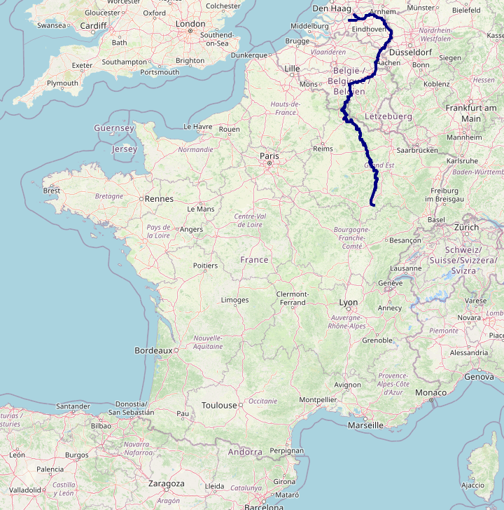
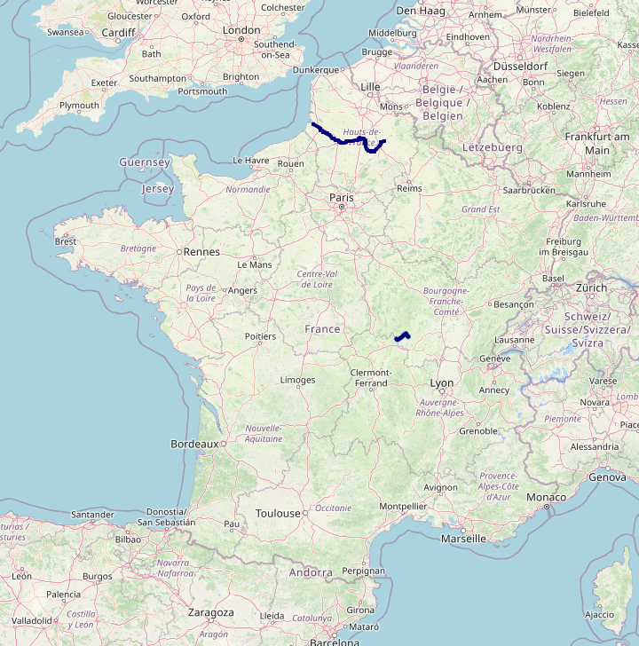

# The Most Useful Rivers of France

**By [MX-Futhark](https://www.geoguessr.com/user/5e6bccf53730754da880600a)**

_If you find a mistake in this document (typo, broken link, anything), feel free to file an issue. Contributions will be mentioned above._

## Introduction

It is common knowledge among GeoGuessr players that town names in France are commonly named after rivers. In fact, over one in twenty town name in France ends with `-sur-<river>` (meaning `on <river>`). The general consensus is to at least learn the course of the [Seine](https://en.wikipedia.org/wiki/Seine), [Loire](https://en.wikipedia.org/wiki/Loire), [Rhône](https://en.wikipedia.org/wiki/Rh%C3%B4ne), [Garonne](https://en.wikipedia.org/wiki/Garonne), and sometimes the [Marne](https://en.wikipedia.org/wiki/Marne_(river)) to cover one's bases. However, while those are undoubtably some of the most famous rivers in France, it doesn't mean that they are the ones that show up the most in place names.

Here is a map of how many towns whose name ends with `-sur-<river>` can be found in each department:

As you can see, the north (and especially the northeast) uses this naming pattern much more often than the south. As the data below will show in more details, how likely it is for a river to show up in a town name is not entirely correlated to its length but rather depends on local naming traditions. For example, there are 13 -sur-Rhône towns in the entirety of France, but 43 -sur-Meuse towns. This is depite the fact that the French section of the Rhône is 545 km long, while the French section of the [Meuse](https://en.wikipedia.org/wiki/Meuse) is 486 km long.

You may have also noticed (or you may already know) that many departments are named after rivers that goes through them. If you find a town called Something-sur-Department, it is tempting to look for the town in said department. Unfortunately, this proves treacherous: there are 7 -sur-[Isère](https://en.wikipedia.org/wiki/Is%C3%A8re_(river)) towns in France and only one of them is located in [Isère](https://en.wikipedia.org/wiki/Is%C3%A8re). It is still a decent backup strategy, but we can do better.

This document provides a list of rivers from most to least useful based on how many towns are named after them, complete with informative links, image of the course of the river, and how to efficiently locate it and scan for towns on Google Maps. If you want to up your France game, I believe learning this list (or even just the top entries) can only make you a better player.

If this sounds too tedious to you, just memorize the map above. If you find a town called Something-sur-River-that-you-don't-know, plonking somewhere east of Paris is a better hedge than label-clicking.

## Methodology

The names of all [communes](https://en.wikipedia.org/wiki/Communes_of_France) (municipalities) in [metropolitan France](https://en.wikipedia.org/wiki/Metropolitan_France) following the pattern `<place>-sur-<river>` were taken into account, and filtered to only keep the rivers featured in ten names or more.
Some places follow this naming pattern but are not actually named after rivers. Typically, "-sur-Mer" means "on the sea". This is useful to know as a player since it indicates a coastal town, but for the purpose of this document, this suffix was excluded. There are other, rarer cases such as [Villers-sur-Port](https://www.google.com/maps/place/70170+Villers-sur-Port) which would be better called Villers-[lès](https://en.wiktionary.org/wiki/l%C3%A8s)-Port since it neighbors [Port-sur-Saône](https://www.google.com/maps/place/70170+Port-sur-Sa%C3%B4ne) and is in fact not named after a body of water at all. Such names were not excluded when cramming the data because it is difficult to detect them, but as far as I can tell none of them made the cut anyway.

### Caveats

1. Not all toponyms named after rivers follow the pattern `<place>-sur-<river>`, which means that the numbers below are an underestimation of reality.
Getting accurate numbers would require diving deep into the etymology of some place names, which is difficult both for me and for casual players, who are likely to stick to recognizing the obvious pattern.
Note that just because a toponym includes the name of a river does not mean that it was named after it, even though it might be the case sometimes.
For example, [Cherbourg](https://www.google.com/maps/place/Cherbourg-en-Cotentin) is completely unrelated to the [Cher](https://en.wikipedia.org/wiki/Cher_(river)), but [Villers-Semeuse](https://www.google.com/maps/place/08000+Villers-Semeuse)'s name does derive from the Meuse.
2. Since only French communes are taken into account, some international rivers may not have reached the threshold even though they are used in toponyms outside of France.
For example, there are no toponyms based on the [Semois](https://en.wikipedia.org/wiki/Semois) in France, but there are a few towns in Wallonia named after it such as [Vresse-sur-Semois](https://www.google.com/maps/place/5550+Vresse-sur-Semois,+Belgium), although this particular river would not have made the list regardless.
Likewise, the numbers below are underestimated for a few rivers that did make the list. For example, the Meuse can frequently be found in Dutch toponyms ([famously](https://en.wikipedia.org/wiki/Maastricht_Treaty), [Maastricht](https://www.google.com/maps/place/Maastricht,+Netherlands)).
3. Much like there are dozens of "Springfield"s in the USA, river names in France are not necessarily unique. As you will see, there are multiple instances where the `<river>` part in `<place>-sur-<river>` may refer to separate streams. In such cases, all homonyms are listed under the same entry if the sum of relevant communes reaches the threshold.

## Structure

Rivers are listed from most to least useful based on the amount of towns named after them. All entries use the following template:

**Native names**: The name of the river in the languages of all countries it goes through. This is useful to deal with possibly relevant but non-French toponyms.

**Info**: Usually a Wikipedia link about the river, in English. You may want to switch the language to French for more details for some of them.

**Course**: Usually an OpenStreetMap link showing the course of the river, accompanied by a raster image.

**How to locate**: How to find and scan the river on Google Maps. This normally involves finding where it flows into the sea or another river then scanning upstream, since it is much more difficult to find a tiny stream at the source then following it downstream. However, there are exceptions to this rule. Also, be careful not to branch towards a tributary river by accident: some of them appear wider than the main stream on the map where they meet, which can trip you up when scanning upstream.

**Communes**: A collapsible list of communes named after the river, with the total amount between parentheses. The communes are categorized by departments, sorted by amount of relevant communes. You are not expected to memorize the communes (not that I am forbiding you from trying), but they are provided for the sake of completeness.

## The List

1. <a href="#spot-01">Seine</a>: 72 communes
1. <a href="#spot-02">Loire</a>: 70 communes
1. <a href="#spot-03">Marne</a>: 55 communes
1. <a href="#spot-04">Meuse</a>: 43 communes
1. <a href="#spot-05">Saône</a>: 33 communes
1. <a href="#spot-06">Sarthe</a>: 22 communes
1. <a href="#spot-07">Cher</a>: 21 communes
1. <a href="#spot-08">Aube</a>: 21 communes
1. <a href="#spot-09">Seille</a>: 19 communes (⚠ 2 separate rivers)
1. <a href="#spot-10">Vienne</a>: 17 communes
1. <a href="#spot-11">Moselle</a>: 17 communes
1. <a href="#spot-12">Yonne</a>: 16 communes
1. <a href="#spot-13">Oise</a>: 16 communes
1. <a href="#spot-14">Garonne</a>: 16 communes
1. <a href="#spot-15">Orne</a>: 15 communes (⚠ 2 separate rivers)
1. <a href="#spot-16">Eure</a>: 14 communes
1. <a href="#spot-17">Allier</a>: 13 communes
1. <a href="#spot-18">Rhône</a>: 13 communes
1. <a href="#spot-19">Aisne</a>: 13 communes
1. <a href="#spot-20">Ouche</a>: 11 communes
1. <a href="#spot-21">Somme</a>: 11 communes (⚠ 2 separate rivers)
1. <a href="#spot-22">Essonne</a>: 11 communes
1. <a href="#spot-23">Saulx</a>: 11 communes
1. <a href="#spot-24">Orge</a>: 11 communes (⚠ 2 separate rivers)
1. <a href="#spot-25">Risle</a>: 11 communes
1. <a href="#spot-26">Tille</a>: 10 communes
1. <a href="#spot-27">Loir</a>: 10 communes
1. <a href="#spot-28">Indre</a>: 10 communes

----------

### 1. Seine 🥇

Unsurprisingly, the most famous river in France reaches the top of the list, with over seventy towns named after it.

**Native names**: _la Seine_ (French)

**Info**: [Wikipedia](https://en.wikipedia.org/wiki/Seine)

**Course**: [OpenStreetMap](https://www.openstreetmap.org/relation/962076)

**How to locate**: If you know where Paris is, you already know where the Seine is. But if you want to scan upstream from where it flows into the English Channel, then look [south of Le Havre in Normandy](https://www.google.com/maps/@49.4534515,0.130091,11.51z), just west of Rouen.

**Communes** (72):

Click me

- Seine-et-Marne
  * Bray-sur-Seine
  * Champagne-sur-Seine
  * Châtenay-sur-Seine
  * Grisy-sur-Seine
  * Livry-sur-Seine
  * Marolles-sur-Seine
  * Le Mée-sur-Seine
  * Melz-sur-Seine
  * Mouy-sur-Seine
  * Noyen-sur-Seine
  * Passy-sur-Seine
  * Samois-sur-Seine
  * Varennes-sur-Seine
  * Vernou-la-Celle-sur-Seine
  * Villiers-sur-Seine
  * Vulaines-sur-Seine
- Yvelines
  * Bonnières-sur-Seine
  * Carrières-sur-Seine
  * Croissy-sur-Seine
  * Flins-sur-Seine
  * Mézières-sur-Seine
  * Mézy-sur-Seine
  * Mousseaux-sur-Seine
  * Rosny-sur-Seine
  * Triel-sur-Seine
  * Vaux-sur-Seine
  * Verneuil-sur-Seine
  * Villennes-sur-Seine
- Aube
  * Bar-sur-Seine
  * Gyé-sur-Seine
  * Marnay-sur-Seine
  * Méry-sur-Seine
  * Mussy-sur-Seine
  * Neuville-sur-Seine
  * Nogent-sur-Seine
  * Pont-sur-Seine
  * Romilly-sur-Seine
  * Saint-Benoît-sur-Seine
- Côte-d'Or
  * Aisey-sur-Seine
  * Bellenod-sur-Seine
  * Charrey-sur-Seine
  * Châtillon-sur-Seine
  * Nod-sur-Seine
  * Noiron-sur-Seine
  * Quemigny-sur-Seine
  * Saint-Marc-sur-Seine
  * Sainte-Colombe-sur-Seine
- Seine-Maritime
  * Berville-sur-Seine
  * Hautot-sur-Seine
  * Oissel-sur-Seine
  * Port-Jérôme-sur-Seine
  * Yville-sur-Seine
- Essonne
  * Morsang-sur-Seine
  * Saintry-sur-Seine
  * Soisy-sur-Seine
  * Vigneux-sur-Seine
- Eure
  * Barneville-sur-Seine
  * Courcelles-sur-Seine
  * Criquebeuf-sur-Seine
  * Quillebeuf-sur-Seine
- Seine-Saint-Denis
  * Épinay-sur-Seine
  * Pierrefitte-sur-Seine
  * Saint-Ouen-sur-Seine
- Val-de-Marne
  * Ablon-sur-Seine
  * Ivry-sur-Seine
  * Vitry-sur-Seine
- Marne
  * Conflans-sur-Seine
  * Marcilly-sur-Seine
- Hauts-de-Seine
  * Asnières-sur-Seine
  * Neuilly-sur-Seine
- Val-d'Oise
  * La Frette-sur-Seine
  * Herblay-sur-Seine

----------

### 2. Loire 🥈

Unsurprinsingly again, the longest river in France also has a high number of towns named after it. The Loire (not to be confused with the Loir, which we will get to) takes the second place.

**Native names**: _la Loire_ (French)

**Info**: [Wikipedia](https://en.wikipedia.org/wiki/Loire)

**Course**: [OpenStreetMap](https://www.openstreetmap.org/relation/132818)

**How to locate**: The Loire flows into the [Bay of Biscay](https://en.wikipedia.org/wiki/Bay_of_Biscay); its estuary is located [just south of Saint-Nazaire](https://www.google.com/maps/@47.2653434,-2.246528,11.03z) (to the west of Nantes).

**Communes** (70):

Click me

- Nièvre
  * Avril-sur-Loire
  * La Celle-sur-Loire
  * La Charité-sur-Loire
  * Cosne-Cours-sur-Loire
  * Fleury-sur-Loire
  * Germigny-sur-Loire
  * Lamenay-sur-Loire
  * Mesves-sur-Loire
  * Neuvy-sur-Loire
  * Pouilly-sur-Loire
  * Saint-Ouen-sur-Loire
  * Sermoise-sur-Loire
  * Sougy-sur-Loire
  * Tracy-sur-Loire
- Loiret
  * Beaulieu-sur-Loire
  * Bonny-sur-Loire
  * Châteauneuf-sur-Loire
  * Châtillon-sur-Loire
  * Meung-sur-Loire
  * Ousson-sur-Loire
  * Ouzouer-sur-Loire
  * Saint-Benoît-sur-Loire
  * Saint-Brisson-sur-Loire
  * Saint-Firmin-sur-Loire
  * Saint-Père-sur-Loire
  * Sully-sur-Loire
- Maine-et-Loire
  * Chalonnes-sur-Loire
  * Champtocé-sur-Loire
  * Ingrandes-le-Fresne-sur-Loire
  * Mauges-sur-Loire
  * Rochefort-sur-Loire
  * Saint-Georges-sur-Loire
  * Sainte-Gemmes-sur-Loire
  * Varennes-sur-Loire
- Loir-et-Cher
  * Chaumont-sur-Loire
  * Cour-sur-Loire
  * Muides-sur-Loire
  * Rilly-sur-Loire
  * Saint-Denis-sur-Loire
  * Saint-Dyé-sur-Loire
  * Veuzain-sur-Loire
- Loire-Atlantique
  * Divatte-sur-Loire
  * Lavau-sur-Loire
  * Mauves-sur-Loire
  * Saint-Sébastien-sur-Loire
  * Sainte-Luce-sur-Loire
  * Thouaré-sur-Loire
  * Vair-sur-Loire
- Haute-Loire
  * Aurec-sur-Loire
  * Chamalières-sur-Loire
  * Cussac-sur-Loire
  * Lavoûte-sur-Loire
  * Monistrol-sur-Loire
  * Solignac-sur-Loire
- Indre-et-Loire
  * La Chapelle-sur-Loire
  * Chouzé-sur-Loire
  * Coteaux-sur-Loire
  * Lussault-sur-Loire
  * Montlouis-sur-Loire
  * Saint-Cyr-sur-Loire
- Saône-et-Loire
  * Gilly-sur-Loire
  * Perrigny-sur-Loire
  * Saint-Aubin-sur-Loire
  * Vitry-sur-Loire
- Allier
  * Gannay-sur-Loire
  * Monétay-sur-Loire
  * Pierrefitte-sur-Loire
- Loire
  * Saint-Jean-Saint-Maurice-sur-Loire
  * Vézelin-sur-Loire
- Cher
  * Belleville-sur-Loire

----------

### 3. Marne 🥉

The Marne completes the podium as the main tributary of the Seine, and is perhaps the only somewhat well-known tributary river in France (the fact that it flows into the Seine so close to Paris is probably one the reasons why).

**Native names**: _la Marne_ (French)

**Info**: [Wikipedia](https://en.wikipedia.org/wiki/Marne_(river))

**Course**: [OpenStreetMap](https://www.openstreetmap.org/relation/1075837)

**How to locate**: The Marne flows into the Seine just outside of Paris. Look [northwest of the label for Créteil](https://www.google.com/maps/@48.8049268,2.4282408,14.43z).

**Communes** (55):

Click me

- Seine-et-Marne
  * Annet-sur-Marne
  * Champs-sur-Marne
  * Changis-sur-Marne
  * Fresnes-sur-Marne
  * Lagny-sur-Marne
  * Mary-sur-Marne
  * Méry-sur-Marne
  * Nanteuil-sur-Marne
  * Précy-sur-Marne
  * Saâcy-sur-Marne
  * Thorigny-sur-Marne
  * Ussy-sur-Marne
  * Vaires-sur-Marne
- Haute-Marne
  * Bayard-sur-Marne
  * Fontaines-sur-Marne
  * Luzy-sur-Marne
  * Marnay-sur-Marne
  * Mussey-sur-Marne
  * Rachecourt-sur-Marne
  * Roches-sur-Marne
  * Rouvroy-sur-Marne
  * Saint-Vallier-sur-Marne
  * Soncourt-sur-Marne
  * Vesaignes-sur-Marne
- Marne
  * Aulnay-sur-Marne
  * Bignicourt-sur-Marne
  * Châtillon-sur-Marne
  * La Chaussée-sur-Marne
  * Cloyes-sur-Marne
  * Condé-sur-Marne
  * Isle-sur-Marne
  * Loisy-sur-Marne
  * Mairy-sur-Marne
  * Tours-sur-Marne
  * Vésigneul-sur-Marne
- Aisne
  * Azy-sur-Marne
  * Barzy-sur-Marne
  * Charly-sur-Marne
  * Chézy-sur-Marne
  * Crouttes-sur-Marne
  * Essômes-sur-Marne
  * Étampes-sur-Marne
  * Passy-sur-Marne
  * Romeny-sur-Marne
  * Trélou-sur-Marne
- Val-de-Marne
  * Bonneuil-sur-Marne
  * Bry-sur-Marne
  * Champigny-sur-Marne
  * Chennevières-sur-Marne
  * Nogent-sur-Marne
  * Ormesson-sur-Marne
  * Le Perreux-sur-Marne
  * Villiers-sur-Marne
- Seine-Saint-Denis
  * Gournay-sur-Marne
  * Neuilly-sur-Marne

----------

### 4. Meuse

This is where we start to deviate from common knowledge. We would expect the Rhône or the Garonne to be here but instead, the Meuse, a major but arguably lesser-known European river, sits just outside the podium, with over forty towns named after it.

**Native names**: _la Meuse_ (French), _de Maas_ (Dutch)

**Info**: [Wikipedia](https://en.wikipedia.org/wiki/Meuse)

**Course**: [main](https://www.openstreetmap.org/relation/1075197), [Bergsche Maas](https://www.openstreetmap.org/relation/1316759#map=12/51.7269/5.0148), [Afgedamde Maas](https://www.openstreetmap.org/relation/13064309) (OpenStreetMap)

**How to locate**: The Meuse flows into the North Sea though the messy [Rhine-Meuse-Scheldt delta](https://en.wikipedia.org/wiki/Rhine%E2%80%93Meuse%E2%80%93Scheldt_delta), which is not practical to start from for scanning purposes. Prefer looking for the prominent [pointe de Givet](https://en.wikipedia.org/wiki/Pointe_de_Givet) at the [Belgian border](https://www.google.com/maps/@50.0418558,4.7810225,11.03z), then follow upstream southwards. (Or downstream northwards if you found a Maas-based name in the Netherlands. Note that there are zero Belgian toponyms based on the Meuse.)

**Communes** (43):

Click me

- Meuse
  * Ambly-sur-Meuse
  * Belleville-sur-Meuse
  * Boncourt-sur-Meuse
  * Brabant-sur-Meuse
  * Bras-sur-Meuse
  * Brieulles-sur-Meuse
  * Charny-sur-Meuse
  * Dieue-sur-Meuse
  * Dugny-sur-Meuse
  * Dun-sur-Meuse
  * Épiez-sur-Meuse
  * Forges-sur-Meuse
  * Génicourt-sur-Meuse
  * Han-sur-Meuse
  * Lacroix-sur-Meuse
  * Laneuville-sur-Meuse
  * Martincourt-sur-Meuse
  * Ourches-sur-Meuse
  * Pagny-sur-Meuse
  * Pont-sur-Meuse
  * Pouilly-sur-Meuse
  * Regnéville-sur-Meuse
  * Rouvrois-sur-Meuse
  * Saint-Germain-sur-Meuse
  * Sassey-sur-Meuse
  * Sivry-sur-Meuse
  * Thierville-sur-Meuse
  * Tilly-sur-Meuse
  * Ugny-sur-Meuse
  * Villers-sur-Meuse
- Haute-Marne
  * Brainville-sur-Meuse
  * Le Châtelet-sur-Meuse
  * Dammartin-sur-Meuse
  * Doncourt-sur-Meuse
  * Malaincourt-sur-Meuse
  * Romain-sur-Meuse
- Ardennes
  * Bogny-sur-Meuse
  * Ham-sur-Meuse
  * Joigny-sur-Meuse
  * Montigny-sur-Meuse
  * Nouvion-sur-Meuse
- Vosges
  * Bazoilles-sur-Meuse
  * Maxey-sur-Meuse

----------

### 5. Saône

The Saône is the longest tributary of the Rhône (which we won't see before a while) and takes the next place.

**Native names**: _la Saône_ (French)

**Info**: [Wikipedia](https://en.wikipedia.org/wiki/Sa%C3%B4ne)

**Course**: [OpenStreetMap](https://www.openstreetmap.org/relation/1075434)

**How to locate**: That's an easy one: the Saône flows into the Rhône at Lyon, in the [southern part of the city](https://www.google.com/maps/@45.7431667,4.8089276,13.94z).

**Communes** (33):

Click me

- Côte-d'Or
  * Auvillars-sur-Saône
  * Charrey-sur-Saône
  * Heuilley-sur-Saône
  * Lamarche-sur-Saône
  * Laperrière-sur-Saône
  * Maxilly-sur-Saône
  * Pontailler-sur-Saône
  * Pouilly-sur-Saône
  * Saint-Symphorien-sur-Saône
- Ain
  * Asnières-sur-Saône
  * Cormoranche-sur-Saône
  * Messimy-sur-Saône
  * Montmerle-sur-Saône
  * Peyzieux-sur-Saône
  * Saint-Laurent-sur-Saône
- Saône-et-Loire
  * Allerey-sur-Saône
  * Bragny-sur-Saône
  * Chalon-sur-Saône
  * Crêches-sur-Saône
  * Gigny-sur-Saône
  * Ouroux-sur-Saône
- Métropole de Lyon
  * Albigny-sur-Saône
  * Fleurieu-sur-Saône
  * Fontaines-sur-Saône
  * Neuville-sur-Saône
  * Rochetaillée-sur-Saône
- Haute-Saône
  * Mercey-sur-Saône
  * Port-sur-Saône
  * Ray-sur-Saône
  * Rupt-sur-Saône
- Vosges
  * Châtillon-sur-Saône
  * Monthureux-sur-Saône
- Rhône
  * Villefranche-sur-Saône

----------

### 6. Sarthe

The Sarthe is a major (indirect) tributary of the Loire, and people in the eponym department love to name their towns after it.

**Native names**: _la Sarthe_ (French)

**Info**: [Wikipedia](https://en.wikipedia.org/wiki/Sarthe_(river))

**Course**: [OpenStreetMap](https://www.openstreetmap.org/relation/1083441)

**How to locate**: The Sarthe converges with the [Mayenne](https://en.wikipedia.org/wiki/Mayenne_(river)) right [north of Angers](https://www.google.com/maps/@47.4907306,-0.5434067,14.43z) (to the east of Nantes) to form the [Maine](https://en.wikipedia.org/wiki/Maine_(river)), which flows for just 11km before reaching the Loire.

**Communes** (22):

Click me

- Sarthe
  * Beaumont-sur-Sarthe
  * Fercé-sur-Sarthe
  * Fresnay-sur-Sarthe
  * Juigné-sur-Sarthe
  * Malicorne-sur-Sarthe
  * Moitron-sur-Sarthe
  * Neuville-sur-Sarthe
  * Noyen-sur-Sarthe
  * Parcé-sur-Sarthe
  * Roëzé-sur-Sarthe
  * Sablé-sur-Sarthe
  * Sainte-Jamme-sur-Sarthe
  * Souvigné-sur-Sarthe
  * La Suze-sur-Sarthe
- Orne
  * Champeaux-sur-Sarthe
  * Condé-sur-Sarthe
  * Coulonges-sur-Sarthe
  * Le Mêle-sur-Sarthe
  * Saint-Agnan-sur-Sarthe
  * Saint-Julien-sur-Sarthe
  * Saint-Léger-sur-Sarthe
  * Sainte-Scolasse-sur-Sarthe

----------

### 7. Cher

The Cher is another tributary of the Loire and flows through central France.

⚠ As mentioned in the methodology section, [Cherbourg(-en-Cotentin)](https://en.wikipedia.org/wiki/Cherbourg-en-Cotentin), whose name could be parsed as Cher-town, has nothing to do with the Cher.
Fortunately, its modern name includes [the peninsula](https://en.wikipedia.org/wiki/Cotentin_Peninsula) at the tip of which it is located.

**Native names**: _le Cher_ (French)

**Info**: [Wikipedia](https://en.wikipedia.org/wiki/Cher_(river))

**Course**: [OpenStreetMap](https://www.openstreetmap.org/relation/4491152)

**How to locate**: The Cher flows into the Loire [just west of Tours](https://www.google.com/maps/@47.3423505,0.4647567,12.49z) (east of Angers, itself east of Nantes).

**Communes** (21):

Click me

- Loir-et-Cher
  * Châtillon-sur-Cher
  * Châtres-sur-Cher
  * Faverolles-sur-Cher
  * Langon-sur-Cher
  * Mareuil-sur-Cher
  * Mennetou-sur-Cher
  * Monthou-sur-Cher
  * Noyers-sur-Cher
  * Saint-Georges-sur-Cher
  * Saint-Julien-sur-Cher
  * Saint-Romain-sur-Cher
  * Selles-sur-Cher
  * Villefranche-sur-Cher
- Cher
  * Châteauneuf-sur-Cher
  * Crézançay-sur-Cher
  * Méry-sur-Cher
  * Saint-Florent-sur-Cher
  * Villeneuve-sur-Cher
- Indre-et-Loire
  * Athée-sur-Cher
  * Azay-sur-Cher
- Puy-de-Dôme
  * Château-sur-Cher

----------

### 8. Aube

The Aube is one of the main tributaries of the Seine, with the beginning of which it follows a close course.

**Native names**: _l'Aube_ (French)

**Info**: [Wikipedia](https://en.wikipedia.org/wiki/Aube_(river))

**Course**: [OpenStreetMap](https://www.openstreetmap.org/relation/1107675)

**How to locate**: Probably the most inconvenient river to locate. Zoom on Troyes (south of Reims) until Romilly-sur-Seine appears on the map northwest of it. Then zoom there until Conflans-sur-Seine appears northwest of it, again. The next town to the east is called [Marcilly-sur-Seine](https://www.google.com/maps/@48.5577643,3.7097397,15.89z), which is where the Aube flows into the Seine. Note that the Aube appears **wider** than the Seine there.

**Communes** (21):

Click me

- Aube
  * Arcis-sur-Aube
  * Bar-sur-Aube
  * Blaincourt-sur-Aube
  * Champigny-sur-Aube
  * Étrelles-sur-Aube
  * Longueville-sur-Aube
  * Molins-sur-Aube
  * Nogent-sur-Aube
  * Saint-Nabord-sur-Aube
  * Villette-sur-Aube
- Haute-Marne
  * Aubepierre-sur-Aube
  * Aulnoy-sur-Aube
  * Bay-sur-Aube
  * Laferté-sur-Aube
  * Lanty-sur-Aube
  * Latrecey-Ormoy-sur-Aube
  * Rouvres-sur-Aube
- Côte-d'Or
  * Montigny-sur-Aube
  * Veuxhaulles-sur-Aube
- Marne
  * Granges-sur-Aube
  * Saron-sur-Aube

----------

### 9. Seille

Now things start to get messy. There are two Seilles, one is a tributary of the Moselle and the other one a tributary of the Saône. There are only three towns named after the latter, but you need to know they exist to avoid guessing Metz on Saône-et-Loire.

**Native names**: _la Seille_ (French)

**Info**: [tributary of the Moselle](https://en.wikipedia.org/wiki/Seille_(Moselle)), [tributary of the Saône](https://en.wikipedia.org/wiki/Seille_(Sa%C3%B4ne)) (Wikipedia)

**Course**: [tributary of the Moselle](https://www.openstreetmap.org/relation/1263866), [tributary of the Saône](https://www.openstreetmap.org/relation/1115813) (OpenStreetMap)

**How to locate**: The first Seille flows into the Moselle in [the northeastern part of Metz](https://www.google.com/maps/@49.1256475,6.1850844,16.97z). The second, less useful Seille can be found by looking for Mâcon (north of Lyon) then following the Saône until it [diverges from the administrative border](https://www.google.com/maps/@46.5200595,4.9332144,15.12z), close to La Truchère.

**Communes** (19):

Click me

Tributary of the Moselle (16):
- Meurthe-et-Moselle
  * Bey-sur-Seille
  * Brin-sur-Seille
  * Mailly-sur-Seille
  * Moncel-sur-Seille
  * Morville-sur-Seille
  * Port-sur-Seille
- Moselle
  * Aboncourt-sur-Seille
  * Aulnois-sur-Seille
  * Coin-sur-Seille
  * Haraucourt-sur-Seille
  * Malaucourt-sur-Seille
  * Vic-sur-Seille
- Jura
  * Blois-sur-Seille
  * Ladoye-sur-Seille
  * Nevy-sur-Seille
  * Ruffey-sur-Seille

Tributary of the Saône (3):
- Saône-et-Loire
  * Huilly-sur-Seille
  * Savigny-sur-Seille
  * Sens-sur-Seille

----------

### 10. Vienne

The Vienne is one of the main tributaries of the Loire.

⚠ [The city of the same name](https://en.wikipedia.org/wiki/Vienne,_Is%C3%A8re) is unrelated to the river.

**Native names**: _la Vienne_ (French)

**Info**: [Wikipedia](https://fr.wikipedia.org/wiki/Vienne_(rivi%C3%A8re_fran%C3%A7aise))

**Course**: [OpenStreetMap](https://www.openstreetmap.org/relation/1075841)

**How to locate**: Look for Saumur, southeast of Angers (east of Nantes). The Vienne flows into the Loire [under the label for Parc naturel régional Loire-Anjou-Touraine](https://www.google.com/maps/@47.2055491,0.0457026,12.79z) just upstream of Saumur.

**Communes** (17):

Click me

- Haute-Vienne
  * Aixe-sur-Vienne
  * Chaillac-sur-Vienne
  * Condat-sur-Vienne
  * Le Palais-sur-Vienne
  * Saillat-sur-Vienne
  * Saint-Brice-sur-Vienne
  * Verneuil-sur-Vienne
- Indre-et-Loire
  * Marcilly-sur-Vienne
  * Parçay-sur-Vienne
  * Ports-sur-Vienne
  * Rilly-sur-Vienne
  * Saint-Germain-sur-Vienne
- Vienne
  * Cenon-sur-Vienne
  * Vaux-sur-Vienne
  * Vouneuil-sur-Vienne
- Charente
  * Ansac-sur-Vienne
  * Exideuil-sur-Vienne

----------

### 11. Moselle

The Moselle is a tributary of the Rhine. You probably already know what some of its course looks like since it forms a significant portion of the border between Luxembourg and Germany.

**Native names**: _la Moselle_ (French), _die Mosel_ (German), _d'Musel_ (Luxembourgish)

**Info**: [Wikipedia](https://en.wikipedia.org/wiki/Moselle)

**Course**: [OpenStreetMap](https://www.openstreetmap.org/relation/390416)

**How to locate**: The Moselle flows downstream from France until the [France-Germany-Luxembourg tripoint](https://www.google.com/maps/@49.4670246,6.3524213,14.15z) at Schengen (yes, [that Schengen](https://en.wikipedia.org/wiki/Schengen_Agreement)).

**Communes** (17):

Click me

- Meurthe-et-Moselle
  * Autreville-sur-Moselle
  * Champey-sur-Moselle
  * Chaudeney-sur-Moselle
  * Flavigny-sur-Moselle
  * Fontenoy-sur-Moselle
  * Neuviller-sur-Moselle
  * Pagny-sur-Moselle
  * Velle-sur-Moselle
- Moselle
  * Ars-sur-Moselle
  * Ay-sur-Moselle
  * Berg-sur-Moselle
  * Corny-sur-Moselle
  * Novéant-sur-Moselle
- Vosges
  * Châtel-sur-Moselle
  * Fresse-sur-Moselle
  * Rupt-sur-Moselle
  * Saint-Maurice-sur-Moselle

----------

### 12. Yonne

The Yonne is another major tributary of the Seine and mostly flows through western [Bourgogne-Franche-Comté](https://en.wikipedia.org/wiki/Bourgogne-Franche-Comt%C3%A9).

**Native names**: _l'Yonne_ (French)

**Info**: [Wikipedia](https://en.wikipedia.org/wiki/Yonne_(river))

**Course**: [OpenStreetMap](https://www.openstreetmap.org/relation/1070961)

**How to locate**: Zoom into Paris until you see Fontainebleau southeast of it. Then zoom again until you see [Montereau](https://www.google.com/maps/@48.3851192,2.9646158,14.22z) just east of Fontainebleau. This is where the Yonne flows into the Seine. Much like the Aube, it appears **wider** than the Seine there.

**Communes** (16):

Click me

- Yonne
  * Champs-sur-Yonne
  * Chemilly-sur-Yonne
  * Coulanges-sur-Yonne
  * Courlon-sur-Yonne
  * Courtois-sur-Yonne
  * Lichères-sur-Yonne
  * Lucy-sur-Yonne
  * Merry-sur-Yonne
  * Pont-sur-Yonne
  * Saint-Aubin-sur-Yonne
  * Trucy-sur-Yonne
  * Villeneuve-sur-Yonne
- Nièvre
  * Marigny-sur-Yonne
  * Mouron-sur-Yonne
  * Villiers-sur-Yonne
- Seine-et-Marne
  * Misy-sur-Yonne

----------

### 13. Oise

The Oise is a major tributary of the Seine, the only one to take its source in Belgium.

**Native names**: _l'Oise_ (French)

**Info**: [Wikipedia](https://en.wikipedia.org/wiki/Oise_(river))

**Course**: [OpenStreetMap](https://www.openstreetmap.org/relation/1083417)

**How to locate**: The Oise flows into the Seine at Maurecourt just northwest of Paris, [south of the label for Cergy](https://www.google.com/maps/@48.9883677,2.064745,12.69z).

**Communes** (16):

Click me

- Val-d'Oise
  * Asnières-sur-Oise
  * Auvers-sur-Oise
  * Beaumont-sur-Oise
  * Bernes-sur-Oise
  * Bruyères-sur-Oise
  * Butry-sur-Oise
  * Champagne-sur-Oise
  * Méry-sur-Oise
  * Neuville-sur-Oise
  * Noisy-sur-Oise
- Aisne
  * Châtillon-sur-Oise
  * Mézières-sur-Oise
  * Monceau-sur-Oise
- Oise
  * Boran-sur-Oise
  * Nogent-sur-Oise
  * Précy-sur-Oise

----------

### 14. Garonne

Despite being one of the major rivers of France (although it takes its source in the Spanish Pyrenees), the Garonne does not even make it into the top 10.

**Native names**: _la Garonne_ (French), _la Garona_ (Catalan)

**Info**: [Wikipedia](https://en.wikipedia.org/wiki/Garonne)

**Course**: [OpenStreetMap](https://www.openstreetmap.org/relation/70423)

**How to locate**: The Garonne flows into the unmissable [Gironde estuary](https://en.wikipedia.org/wiki/Gironde_estuary) alongside the [Dordogne](https://en.wikipedia.org/wiki/Dordogne_(river)). [Where they meet](https://www.google.com/maps/@45.0043955,-0.6289374,12.21z), the Garonne is to the west of the Dordogne.

**Communes** (16):

Click me

- Lot-et-Garonne
  * Caumont-sur-Garonne
  * Couthures-sur-Garonne
  * Fourques-sur-Garonne
  * Meilhan-sur-Garonne
  * Sérignac-sur-Garonne
  * Thouars-sur-Garonne
- Haute-Garonne
  * Gagnac-sur-Garonne
  * Gensac-sur-Garonne
  * Portet-sur-Garonne
  * Roquefort-sur-Garonne
  * Saint-Julien-sur-Garonne
  * Salles-sur-Garonne
- Gironde
  * Cadillac-sur-Garonne
  * Lestiac-sur-Garonne
  * Le Pian-sur-Garonne
- Tarn-et-Garonne
  * Verdun-sur-Garonne

----------

### 15. Orne

Another Seille situation: the longer Orne is a river in Normandy; the shorter one is a tributary of the Moselle south of Luxembourg. Only two towns are named after the latter, but again, they are included to avoid mishaps.

**Native names**: _l'Orne_ (French)

**Info**: [river in Normandy](https://en.wikipedia.org/wiki/Orne_(river)), [tributary of the Moselle](https://en.wikipedia.org/wiki/Orne_(Moselle)) (Wikipedia)

**Course**: [river in Normandy](https://www.openstreetmap.org/relation/1075690), [tributary of the Moselle](https://www.openstreetmap.org/relation/1111462) (OpenStreetMap)

**How to locate**: The most useful Orne flows into the English Channel [north of Caen](https://www.google.com/maps/@49.2568104,-0.2888111,11.72z). The other one flows into the Moselle [where the A30 meets the A31](https://www.google.com/maps/@49.2818311,6.1770404,14.15z), just northeast of Amnéville, north of Metz.

**Communes** (15):

Click me

River in Normandy (13):
- Calvados
  * Amayé-sur-Orne
  * Blainville-sur-Orne
  * Fleury-sur-Orne
  * May-sur-Orne
  * Montillières-sur-Orne
  * Saint-André-sur-Orne
- Orne
  * Aunou-sur-Orne
  * Juvigny-sur-Orne
  * Ménil-Hubert-sur-Orne
  * Monts-sur-Orne
  * Moulins-sur-Orne
  * Saint-Philbert-sur-Orne
- Sarthe
  * Congé-sur-Orne

Tributary of the Moselle (2):
- Meuse
  * Maucourt-sur-Orne
- Moselle
  * Vitry-sur-Orne

----------

### 16. Eure

The Eure is yet another tributary of the Seine, located some distance west of Paris.

**Native names**: _l'Eure_ (French)

**Info**: [Wikipedia](https://en.wikipedia.org/wiki/Eure_(river))

**Course**: [OpenStreetMap](https://www.openstreetmap.org/relation/1083661)

**How to locate**: The Eure flows into the Seine [just east of Elbeuf](https://www.google.com/maps/@49.2977161,1.0230374,13.67z), south of Rouen.

**Communes** (14):

Click me

- Eure
  * Cailly-sur-Eure
  * Croisy-sur-Eure
  * Ézy-sur-Eure
  * Garennes-sur-Eure
  * Heudreville-sur-Eure
  * Jouy-sur-Eure
  * Marcilly-sur-Eure
  * Pacy-sur-Eure
  * Vaux-sur-Eure
- Eure-et-Loire
  * Courville-sur-Eure
  * Fontenay-sur-Eure
  * Nogent-sur-Eure
  * Saint-Georges-sur-Eure
  * Villemeux-sur-Eure

----------

### 17. Allier

It's been a while since we haven't had a tributary of the Loire. The Allier is pretty damn long but doesn't give its name to that many towns for its length.

**Native names**: _l'Allier_ (French)

**Info**: [Wikipedia](https://en.wikipedia.org/wiki/Allier_(river))

**Course**: [OpenStreetMap](https://www.openstreetmap.org/relation/1075830)

**How to locate**: The Allier flows into the Loire [southwest of Nevers](https://www.google.com/maps/@46.9915844,3.1173095,12.69z), to the east of Bourges (south of Paris, right above the label for France).

**Communes** (13):

Click me

- Allier
  * Bellerive-sur-Allier
  * Bessay-sur-Allier
  * Château-sur-Allier
  * Monétay-sur-Allier
  * Toulon-sur-Allier
  * Varennes-sur-Allier
  * Villeneuve-sur-Allier
- Puy-de-Dôme
  * Mur-sur-Allier
  * Pérignat-sur-Allier
  * Saint-Georges-sur-Allier
- Cher
  * Apremont-sur-Allier
  * Mornay-sur-Allier
- Nièvre
  * Mars-sur-Allier

----------

### 18. Rhône

The final major river and the last one of its kind in this list. There are relatively few towns in France named after the Rhône.

**Native names**: _le Rhône_ (French), _die Rhone_ (Standard German), _der Rotten_ (Walser German), _il Rodano_ (Italian)

**Info**: [Wikipedia](https://en.wikipedia.org/wiki/Rh%C3%B4ne)

**Course**: [main & Great Rhône](https://www.openstreetmap.org/relation/1075117), [Little Rhône](https://www.openstreetmap.org/relation/6948088) (OpenStreetMap)

**How to locate**: Since the Rhône splits into the Great Rhône and the Little Rhône in [Camargue](https://en.wikipedia.org/wiki/Camargue), it is more practical to locate it by following it downstream from [Lake Geneva](https://en.wikipedia.org/wiki/Lake_Geneva), which is located [exactly where you would expect](https://www.google.com/maps/@46.209537,6.1382542,13.18z). Note that no Swiss toponyms are named after the Rhône.

**Communes** (13):

Click me

- Ardèche
  * Arras-sur-Rhône
  * Charmes-sur-Rhône
  * Tournon-sur-Rhône
  * La Voulte-sur-Rhône
- Drôme
  * Étoile-sur-Rhône
  * Saulce-sur-Rhône
  * Serves-sur-Rhône
- Rhône
  * Loire-sur-Rhône
  * Saint-Cyr-sur-le-Rhône
- Haute-Savoie
  * Saint-Germain-sur-Rhône
- Isère
  * Chasse-sur-Rhône
- Loire
  * Saint-Michel-sur-Rhône
- Métropole de Lyon
  * Grigny-sur-Rhône

----------

### 19. Aisne

The Aisne is a tributary of the Oise, which it even beats in length. It flows close to the Belgian border.

**Native names**: _l'Aisne_ (French)

**Info**: [Wikipedia](https://en.wikipedia.org/wiki/Aisne_(river))

**Course**: [OpenStreetMap](https://www.openstreetmap.org/relation/1075850)

**How to locate**: The Aisne flows into the Oise at [Compiègne](https://www.google.com/maps/@49.433168,2.84817,13.83z), where it appears **wider** than its mainstem. Compiègne is located northeast of Paris and west of Reims, roughly equidistant to both cities.

**Communes** (13):

Click me

- Aisne
  * Billy-sur-Aisne
  * Celles-sur-Aisne
  * Condé-sur-Aisne
  * Missy-sur-Aisne
  * Neufchâtel-sur-Aisne
  * Vailly-sur-Aisne
  * Vic-sur-Aisne
  * Villeneuve-sur-Aisne
- Ardennes
  * Brienne-sur-Aisne
  * Nanteuil-sur-Aisne
  * Rilly-sur-Aisne
  * Savigny-sur-Aisne
- Oise
  * Berneuil-sur-Aisne

----------

### 20. Ouche

Now obscure rivers start to make their appearance. The Ouche is a tributary of the Saône and has a suprising amount of towns named after it despite being shorter than 100 km.

**Native names**: _l'Ouche_ (French)

**Info**: [Wikipedia](https://en.wikipedia.org/wiki/Ouche)

**Course**: [OpenStreetMap](https://www.openstreetmap.org/relation/1113540)

**How to locate**: The Ouche is confusing to follow upstream [from the Saône](https://www.google.com/maps/@47.1079468,5.2818796,15.06z) because it appears very narrow on the map and there are many other small rivers in the same area. However, all -sur-Ouche towns are located upstream of Dijon, [through which](https://www.google.com/maps/@47.3173908,5.0146603,14.85z) the Ouche flows, so I recommend scanning upstream (westwards) from there instead.

**Communes** (11):

Click me

- Côte-d'Or
  * Barbirey-sur-Ouche
  * Bligny-sur-Ouche
  * La Bussière-sur-Ouche
  * Fleurey-sur-Ouche
  * Gissey-sur-Ouche
  * Lusigny-sur-Ouche
  * Saint-Victor-sur-Ouche
  * Sainte-Marie-sur-Ouche
  * Thorey-sur-Ouche
  * Velars-sur-Ouche
  * Veuvey-sur-Ouche

----------

### 21. Somme

The Somme is a river in Picardy, one of many to flow into the English Channel. Unfortunately, it is also the name of small tributary of the Loire after which a single town was named.

**Native names**: _la Somme_ (French)

**Info**: [river in Picardy](https://en.wikipedia.org/wiki/Somme_(river)), [tributary of the Loire](https://fr.wikipedia.org/wiki/Somme_(affluent_de_la_Loire)) (Wikipedia)

**Course**: river in Picardy: [source to first canal](https://www.openstreetmap.org/relation/1599269), [first canal onwards](https://www.openstreetmap.org/relation/1162695) (OpenStreetMap), [tributary of the Loire](https://www.sandre.eaufrance.fr/geo/CoursEau_Carthage2017/K16-0300) (SANDRE)

**How to locate**: The estuary of the rightful Somme is located [northwest of Amiens](https://www.google.com/maps/@50.1645066,1.4237011,10.18z) (north of Paris). The impostor Somme is only of interest because it gave its name to [Cressy-sur-Somme](https://www.google.com/maps/place/71760+Cressy-sur-Somme), which is annoyingly placed in the middle of nowhere. Zoom south of Parc naturel régional du Morvan, between Paris and Lyon, until the label appears close to the border between Nièvre and Saône-et-Loire.

**Communes** (11):

Click me

River in Picardy (10):
- Somme
  * Ailly-sur-Somme
  * Belloy-sur-Somme
  * Béthencourt-sur-Somme
  * Bray-sur-Somme
  * Cléry-sur-Somme
  * Eaucourt-sur-Somme
  * Fontaine-sur-Somme
  * Hangest-sur-Somme
  * Saint-Valery-sur-Somme
  * Vaux-sur-Somme

Tributary of the Loire (1):
- Saône-et-Loire
  * Cressy-sur-Somme

----------

### 22. Essonne

The Essonne is a relatively short tributary of the Seine that flows just south of Paris.

**Native names**: _l'Essonne_ (French)

**Info**: [Wikipedia](https://en.wikipedia.org/wiki/Essonne_(river))

**Course**: [OpenStreetMap](https://www.openstreetmap.org/relation/1104573)

**How to locate**: The Essonne flows into the Seine at [Corbeille-Essonnes](https://www.google.com/maps/@48.6115557,2.4776275,15.87z) (which is not part of the list below!). You can find it by zooming into Paris until Melun appears southeast of it, then zooming further in this area until the label for Corbeille-Essonnes appears between Paris and Melun.

**Communes** (11):

Click me

- Essonne
  * Ballancourt-sur-Essonne
  * Boutigny-sur-Essonne
  * Courdimanche-sur-Essonne
  * Gironville-sur-Essonne
  * Guigneville-sur-Essonne
  * Prunay-sur-Essonne
  * Vayres-sur-Essonne
- Loiret
  * Briarres-sur-Essonne
  * La Neuville-sur-Essonne
  * Ondreville-sur-Essonne
- Seine-et-Marne
  * Nanteau-sur-Essonne

----------

### 23. Saulx

The Saulx is a tributary of the Marne. Be careful: it is also part of the name of [several unrelated towns](https://en.wikipedia.org/wiki/Saulx).

**Native names**: _la Saulx_ (French)

**Info**: [Wikipedia](https://en.wikipedia.org/wiki/Saulx_(river))

**Course**: [OpenStreetMap](https://www.openstreetmap.org/relation/1267377)

**How to locate**: Zoom into Troyes (south of Reims) until Vitry-le-François appears northeast of it. The Saulx flows into the Marne [right north of the town](https://www.google.com/maps/@48.7398076,4.5795815,14.67z).

**Communes** (11):

Click me

- Meuse
  * Bazincourt-sur-Saulx
  * Beurey-sur-Saulx
  * Le Bouchon-sur-Saulx
  * Dammarie-sur-Saulx
  * Ménil-sur-Saulx
  * Montiers-sur-Saulx
  * Trémont-sur-Saulx
  * Ville-sur-Saulx
- Marne
  * Bignicourt-sur-Saulx
  * Pargny-sur-Saulx
- Haute-Marne
  * Paroy-sur-Saulx

----------

### 24. Orge

The Orge is both the name of a short tributary of the Seine, and annoyingly, the name of a small stream that flows into the Saulx after which is single town is named. Good news though: this is the last entry with two rivers on the list.

**Native names**: _l'Orge_ (French)

**Info**: [tributary of the Seine](https://en.wikipedia.org/wiki/Orge), [tributary of the Saulx](https://fr.wikipedia.org/wiki/Orge_(ruisseau))

**Course**: [tributary of the Seine](https://www.openstreetmap.org/relation/1113571) (OpenStreetMap), [tributary of the Saulx](https://www.sandre.eaufrance.fr/geo/CoursEau_Carthage2017/F5510600) (SANDRE)

**How to locate**: The big sister flows into the Seine at [Athis-Mons](https://www.google.com/maps/@48.7109379,2.3971579,15.5z), south of Orly airport (right south of Paris). The little sister is only of interest because of [Biencourt-sur-Orge](https://www.google.com/maps/place/55290+Biencourt-sur-Orge). Zoom between Nancy and Troyes, then on Saint-Dizier until Montiers-sur-Saulx appears to its southeast. Biencourt-sur-Orge is located just northeast of it.

**Communes** (11):

Click me

Tributary of the Seine (10)
- Essonne
  * Brétigny-sur-Orge
  * Épinay-sur-Orge
  * Juvisy-sur-Orge
  * Leuville-sur-Orge
  * Longpont-sur-Orge
  * Morsang-sur-Orge
  * Saint-Michel-sur-Orge
  * Savigny-sur-Orge
  * Villemoisson-sur-Orge
  * Villiers-sur-Orge

Tributary of the Saulx (1):
- Meuse
  * Biencourt-sur-Orge

----------

### 25. Risle

The Risle is another river in Picardy and shares its estuary with the Seine.

**Native names**: _la Risle_ (French)

**Info**: [Wikipedia](https://en.wikipedia.org/wiki/Risle)

**Course**: [OpenStreetMap](https://www.openstreetmap.org/relation/1204782)

**How to locate**: If you can find the estuary of the Seine (as a reminder: right south of Le Havre, west of Rouen), you can find the Risle which is dwarfed by the Seine at [Berville-sur-Mer](https://www.google.com/maps/@49.4417422,0.365008,13.86z).

**Communes** (11):

Click me

- Eure
  * Condé-sur-Risle
  * Corneville-sur-Risle
  * La Ferrière-sur-Risle
  * Freneuse-sur-Risle
  * Glos-sur-Risle
  * Grosley-sur-Risle
  * Manneville-sur-Risle
  * Montfort-sur-Risle
  * Saint-Philbert-sur-Risle
- Orne
  * Saint-Hilaire-sur-Risle
  * Saint-Sulpice-sur-Risle

----------

### 26. Tille

The Tille is a relatively short tributary of the Saône. Conveniently, it is entirely contained within the Côte-d'Or department.

**Native names**: _la Tille_ (French)

**Info**: [Wikipedia](https://en.wikipedia.org/wiki/Tille_(river))

**Course**: [OpenStreetMap](https://www.openstreetmap.org/relation/1599283)

**How to locate**: Zoom into Dijon until Auxonne appears to the southeast, then follow the Saône southwards. You will shortly find the point where the Tille flows into it, [south of Les Maillys](https://www.google.com/maps/@47.1315996,5.341796,15.32z).

**Communes** (10):

Click me

- Côte-d'Or
  * Arc-sur-Tille
  * Bressey-sur-Tille
  * Cessey-sur-Tille
  * Crécey-sur-Tille
  * Is-sur-Tille
  * Magny-sur-Tille
  * Marcilly-sur-Tille
  * Marey-sur-Tille
  * Remilly-sur-Tille
  * Villey-sur-Tille

----------

### 27. Loir

The Loir is a tributary of the Sarthe, itself a tributary of the Loire. It bears repeating: despite being pronounced the same, the Loir is not the Loire.

**Native names**: _le Loir_ (French)

**Info**: [Wikipedia](https://en.wikipedia.org/wiki/Loir)

**Course**: [OpenStreetMap](https://www.openstreetmap.org/relation/1082558)

**How to locate**: The Loir flows into the Sarthe [between Briollay and Écouflant](https://www.google.com/maps/@47.5485015,-0.5234623,14.24z), just north of Angers (east of Nantes)

**Communes** (10):

Click me

- Sarthe
  * La Bruère-sur-Loir
  * La Chartre-sur-le-Loir
  * Mareil-sur-Loir
  * Montval-sur-Loir
  * Nogent-sur-Loir
- Loir-et-Cher
  * Montoire-sur-le-Loir
  * Villiers-sur-Loir
- Maine-et-Loire
  * Montreuil-sur-Loir
  * Seiches-sur-le-Loir
- Eure-et-Loire
  * Saint-Maur-sur-le-Loir

----------

### 28. Indre

The Indre is the final river to reach the threshold. It is a relatively long tributary of the Loire.

**Native names**: _l'Indre_ (French)

**Info**: [Wikipedia](https://en.wikipedia.org/wiki/Indre_(river))

**Course**: [OpenStreetMap](https://www.openstreetmap.org/relation/1083512)

**How to locate**: The Indre flows into the Loire [just upstream of where the Vienne does](https://www.google.com/maps/@47.2278311,0.1701091,13.58z). Therefore, the same instructions apply:
> Look for Saumur, southeast of Angers (east of Nantes). The Vienne flows into the Loire [under the label for the Parc naturel régional Loire-Anjou-Touraine](https://www.google.com/maps/@47.2055491,0.0457026,12.79z) just upstream of Saumur.

**Communes** (10):

Click me

- Indre
  * Châtillon-sur-Indre
  * Mers-sur-Indre
  * Palluau-sur-Indre
  * Sainte-Sévère-sur-Indre
  * Villedieu-sur-Indre
- Indre-et-Loire
  * Artannes-sur-Indre
  * Azay-sur-Indre
  * Chambourg-sur-Indre
  * Reignac-sur-Indre
  * Verneuil-sur-Indre

## Conclusion

As of January 2025, there were 34805 communes in metropolitan France, 1897 of which followed the `<place>-sur-<river>` pattern, and 602 of which made the above list. In other words, learning the location of the aforementioned rivers will assist you in regionguessing panoramas that include a commune name 1.73% of the time. While it sounds disappointingly low, the odds of seeing such place names are compounded in moving games, which is where learning these rivers will come in handy most of the time.

If you made it to the end, congratulations and thank you for taking the time to read it all! If this document can help even just of few people improve at France, I would consider my duty done.
